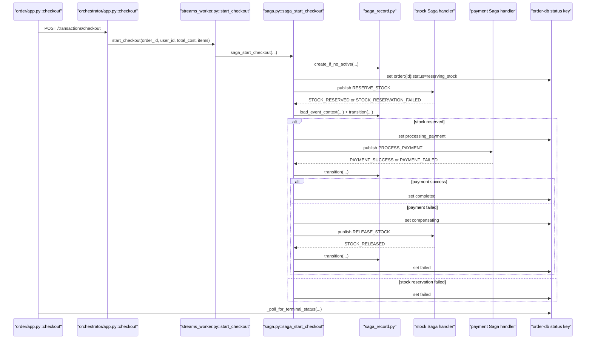
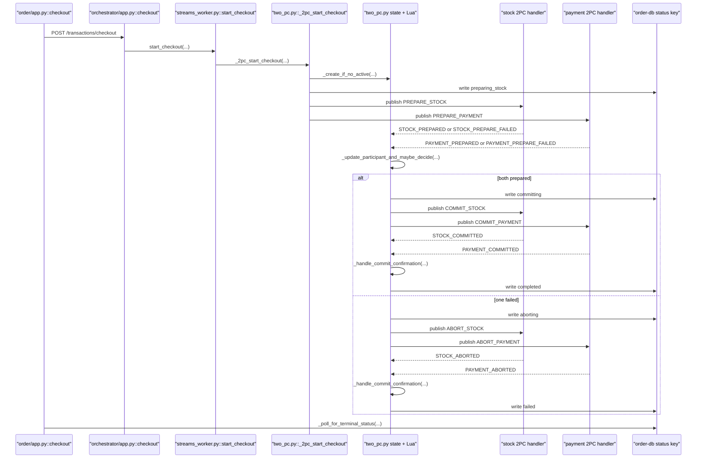

# DDS26 Team 19 Code Walkthrough

This document is the code-level companion to [`../README.md`](../README.md) and [`explanation_architecture.md`](explanation_architecture.md).

Use the two documents differently:

- `README.md`: public project entrypoint, architecture summary, deployment and test commands
- `explanation_architecture.md`: high-level architecture, runtime flow, and design rationale
- `CODE_WALKTHROUGH.md`: implementation details, important functions, file structure, how the code actually works

The goal of this file is that any team member can open the codebase, follow this guide, and understand not just the design, but the actual implementation choices.

## 1. Repository map

The important directories are:

- [`order/`](order): order service
- [`orchestrator/`](orchestrator): transaction orchestration layer for Saga and 2PC
- [`stock/`](stock): stock service
- [`payment/`](payment): payment service
- [`common/`](common): shared message and stream tooling
- [`docker/compose/`](docker/compose): small, medium, and large cluster definitions
- [`nginx/`](nginx): gateway configurations for each cluster size
- [`test/`](test): protocol/unit/recovery tests
- [`tests_external/`](tests_external): professor-style consistency and stress harnesses

The most important code files are:

- [`common/messages.py`](common/messages.py)
- [`common/streams_client.py`](common/streams_client.py)
- [`order/app.py`](order/app.py)
- [`orchestrator/app.py`](orchestrator/app.py)
- [`orchestrator/streams_worker.py`](orchestrator/streams_worker.py)
- [`orchestrator/leader_lease.py`](orchestrator/leader_lease.py)
- [`orchestrator/protocols/saga/saga.py`](orchestrator/protocols/saga/saga.py)
- [`orchestrator/protocols/saga/saga_record.py`](orchestrator/protocols/saga/saga_record.py)
- [`orchestrator/protocols/two_pc.py`](orchestrator/protocols/two_pc.py)
- [`stock/ledger.py`](stock/ledger.py)
- [`stock/streams_worker.py`](stock/streams_worker.py)
- [`stock/transaction_modes/saga.py`](stock/transaction_modes/saga.py)
- [`stock/transaction_modes/two_pc.py`](stock/transaction_modes/two_pc.py)
- [`payment/ledger.py`](payment/ledger.py)
- [`payment/streams_worker.py`](payment/streams_worker.py)
- [`payment/transactions_modes/saga.py`](payment/transactions_modes/saga.py)
- [`payment/transactions_modes/two_pc.py`](payment/transactions_modes/two_pc.py)

## 2. Frameworks and runtimes

The repo does not use one framework everywhere. That is intentional.

### Order service

[`order/requirements.txt`](order/requirements.txt) shows:

- `Quart`
- `Hypercorn`
- `redis`
- `msgspec`
- `requests`

Why:

- `Quart` is async-compatible, which helps because `order-service` waits for checkout completion
- `Hypercorn` runs the Quart app
- `requests` is used to call the gateway and orchestrator
- `msgspec` is used for compact serialization of order objects in Redis

### Orchestrator, stock, payment

[`orchestrator/requirements.txt`](orchestrator/requirements.txt), [`stock/requirements.txt`](stock/requirements.txt), and [`payment/requirements.txt`](payment/requirements.txt) show:

- `Flask`
- `Gunicorn`
- `redis`
- `msgspec`

Why:

- these services are mostly synchronous request handlers plus background worker threads
- `Flask` is enough for the HTTP layer
- the real concurrency comes from Redis stream workers, not async request handling

### Shared infrastructure

The real runtime is not the web framework. It is:

- Redis for storage
- Redis Streams for messaging
- Redis consumer groups + pending-entry recovery for fault tolerance
- background threads for event processing and recovery

That is why the most important code is not the HTTP routes, but the stream worker and protocol modules.

## 3. Shared message protocol

Start with [`common/messages.py`](common/messages.py).

This file is the shared language of the system. It defines:

- stream names
- command/event type strings
- order status enums for Saga and 2PC
- message builders

Important parts:

- [`common/messages.py#L23`](common/messages.py#L23): topic names
- [`common/messages.py#L48`](common/messages.py#L48): `SagaOrderStatus`
- [`common/messages.py#L57`](common/messages.py#L57): `TwoPhaseOrderStatus`
- [`common/messages.py#L142`](common/messages.py#L142): `build_message(...)`

Why this matters:

- every service reads and writes the same message shape
- there is no guessing about field names
- `message_id` is used for deduplication
- `tx_id` ties the distributed transaction together across services

If someone asks “what exactly is on the wire?”, this file is the answer.

## 4. Redis Streams wrapper

[`common/streams_client.py`](common/streams_client.py) is the transport abstraction over Redis Streams.

Important functions:

- [`common/streams_client.py#L113`](common/streams_client.py#L113): `ensure_group(...)`
- [`common/streams_client.py#L140`](common/streams_client.py#L140): `publish(...)`
- [`common/streams_client.py#L173`](common/streams_client.py#L173): `read_many(...)`
- [`common/streams_client.py#L314`](common/streams_client.py#L314): `ack_many(...)`
- [`common/streams_client.py#L329`](common/streams_client.py#L329): `claim_orphans(...)`

What each one does:

- `ensure_group(...)`
  - creates the Redis consumer group if it does not exist
  - used on startup by every stream worker
- `publish(...)`
  - wraps `XADD`
  - encodes messages as msgpack under field `d`
- `read_many(...)`
  - wraps `XREADGROUP`
  - reads either new messages (`>`) or pending messages (`0`)
- `ack_many(...)`
  - wraps `XACK`
  - acknowledges a processed batch efficiently
- `claim_orphans(...)`
  - wraps `XAUTOCLAIM`
  - reassigns pending messages that belonged to a dead worker

This class is what makes the system event-driven and fault-tolerant without Kafka.

## 5. Rate-limited worker error logging

[`common/worker_logging.py`](common/worker_logging.py) is small but important.

Main function:

- `log_worker_exception(...)`

It classifies common restart-time errors:

- DNS temporarily missing
- Redis connection closed
- connection reset
- connection refused

Why it exists:

- during container restarts, workers should retry rather than spam logs
- this keeps fault-tolerance tests readable

## 6. Order service walkthrough

The order service is in [`order/app.py`](order/app.py).

### Data model

[`order/app.py#L68`](order/app.py#L68) defines `OrderValue`.

Fields:

- `paid`
- `items`
- `user_id`
- `total_cost`

Orders are stored in `order-db` using msgpack.

### Helper functions

Important helpers:

- `get_order_from_db(...)`
- `get_order_status(...)`
- `get_order_and_status(...)`
- async variants of the status helpers

These are intentionally split because:

- order contents and checkout status are separate Redis keys
- order-service needs both sync and async access paths

### Checkout waiting logic

The most important logic is:

- [`order/app.py#L130`](order/app.py#L130): `_poll_for_terminal_status(...)`
- [`order/app.py#L175`](order/app.py#L175): `_resolve_uncertain_checkout_start(...)`
- [`order/app.py#L270`](order/app.py#L270): `checkout(...)`

This is one of the most important pieces in the repo.

#### `_poll_for_terminal_status(...)`

This function:

- repeatedly reads `order:<order_id>:status` from `order-db`
- waits until the status becomes terminal
- returns `200` for success or `400` for failure
- returns a timeout response if the orchestrator never reaches a terminal state

Why this design exists:

- in medium/large, multiple order-service replicas exist
- the replica receiving the HTTP request is not guaranteed to be the one that would see local completion state
- by polling shared durable state in Redis, any replica can safely answer the request

#### `_resolve_uncertain_checkout_start(...)`

This function handles the case where the call to the orchestrator failed or returned a `5xx`, but the transaction may actually have started.

It checks:

- if status is in progress, keep polling
- if status is terminal, build the final response
- if no status exists, return `None`

This is why the system does not incorrectly fail a checkout just because the network path to the orchestrator glitched.

#### `checkout(...)`

Flow:

1. load the order and current status
2. if already complete, return success immediately
3. if already in progress, keep waiting
4. otherwise call `POST /transactions/checkout` on the orchestrator
5. if that call succeeds, poll until terminal state
6. if that call fails or returns `5xx`, use `_resolve_uncertain_checkout_start(...)`

This function is the bridge between synchronous HTTP and asynchronous orchestration.

### Other order routes

Important route functions:

- [`order/app.py#L185`](order/app.py#L185): `create_order(...)`
- [`order/app.py#L222`](order/app.py#L222): `find_order(...)`
- [`order/app.py#L236`](order/app.py#L236): `order_status(...)`
- [`order/app.py#L251`](order/app.py#L251): `add_item(...)`

Points worth noticing:

- `add_item(...)` fetches item price from the stock service through the gateway
- `find_order(...)` marks an order as paid if either:
  - the stored order says `paid=True`, or
  - the durable checkout status is terminal success

## 7. Orchestrator HTTP facade

[`orchestrator/app.py`](orchestrator/app.py) is deliberately thin.

Important functions:

- [`orchestrator/app.py#L50`](orchestrator/app.py#L50): `checkout()`
- [`orchestrator/app.py#L77`](orchestrator/app.py#L77): `health()`

What `checkout()` does:

- parse the input JSON
- validate that `order_id`, `user_id`, and `total_cost` exist
- ensure the orchestrator runtime is available
- call `start_checkout(...)` in [`orchestrator/streams_worker.py`](orchestrator/streams_worker.py)

What it does not do:

- it does not directly talk to stock or payment
- it does not block until the transaction is done
- it does not contain Saga or 2PC logic itself

That logic is pushed into the runtime and protocol modules.

## 8. Orchestrator runtime

[`orchestrator/streams_worker.py`](orchestrator/streams_worker.py) is where the orchestrator actually becomes a coordinator.

Important functions:

- [`orchestrator/streams_worker.py#L224`](orchestrator/streams_worker.py#L224): `init_streams(...)`
- [`orchestrator/streams_worker.py#L202`](orchestrator/streams_worker.py#L202): `_recovery_loop(...)`
- [`orchestrator/streams_worker.py#L319`](orchestrator/streams_worker.py#L319): `start_checkout(...)`

### `init_streams(...)`

This function:

1. stores Redis handles for:
   - `orchestrator-db`
   - `order-db`
   - `stock-db`
   - `payment-db`
2. creates `StreamsClient` objects for stock/payment
3. ensures all needed Redis stream consumer groups exist
4. defines `publish_fn(...)`
5. initializes leader election
6. initializes Saga or 2PC
7. runs startup recovery if this replica is leader
8. starts:
   - stock event workers
   - payment event workers
   - orphan recovery workers
   - the recovery loop

This is the orchestrator’s actual bootstrap sequence.

### `_recovery_loop(...)`

This is the background loop that periodically rechecks unfinished transactions.

Key design detail:

- only the leader runs it

Behavior:

- in Saga mode: call `saga_check_timeouts(...)`
- in 2PC mode: call `recover_incomplete_2pc()`

### `start_checkout(...)`

This dispatches to the active protocol:

- Saga: `saga_start_checkout(...)`
- 2PC: `_2pc_start_checkout(...)`

This is the main runtime entrypoint the HTTP facade uses.

## 9. Leader lease

[`orchestrator/leader_lease.py`](orchestrator/leader_lease.py) is what makes multiple orchestrator replicas safe.

Important functions:

- [`orchestrator/leader_lease.py#L50`](orchestrator/leader_lease.py#L50): `init_lease(...)`
- [`orchestrator/leader_lease.py#L70`](orchestrator/leader_lease.py#L70): `is_leader()`
- [`orchestrator/leader_lease.py#L75`](orchestrator/leader_lease.py#L75): `release_lease()`
- [`orchestrator/leader_lease.py#L136`](orchestrator/leader_lease.py#L136): `_renew_loop()`

How it works:

- it stores leadership in Redis key `orchestrator:leader`
- a replica tries `SET key value NX EX 15`
- the current leader renews its TTL every 5 seconds
- if the leader dies, the key expires and another replica can win

Why this is needed:

- all orchestrator replicas may serve HTTP and consume participant events
- but only one replica should perform timeout scanning and startup recovery

Important correctness details:

- on Redis error, the current leader steps down immediately
- release is compare-and-delete, so one replica cannot delete another replica’s lease by accident

## 10. Saga coordinator

The Saga coordinator is implemented in [`orchestrator/protocols/saga/saga.py`](orchestrator/protocols/saga/saga.py).

Important functions:

- [`orchestrator/protocols/saga/saga.py#L63`](orchestrator/protocols/saga/saga.py#L63): `saga_start_checkout(...)`
- [`orchestrator/protocols/saga/saga.py#L127`](orchestrator/protocols/saga/saga.py#L127): `saga_route_order(...)`
- [`orchestrator/protocols/saga/saga.py#L295`](orchestrator/protocols/saga/saga.py#L295): `recover(...)`
- [`orchestrator/protocols/saga/saga.py#L322`](orchestrator/protocols/saga/saga.py#L322): `check_timeouts(...)`

### `saga_start_checkout(...)`

This function:

1. creates a fresh `tx_id`
2. canonicalizes order items by merging duplicate item ids
3. creates a durable Saga record in `orchestrator-db`
4. writes initial order status into `order-db`
5. publishes `RESERVE_STOCK`

Why canonicalize items:

- if the same item appears twice in an order, stock logic should see one combined quantity

### `saga_route_order(...)`

This is the event router for participant replies.

It first loads context with [`saga_record.load_event_context(...)`](orchestrator/protocols/saga/saga_record.py#L81), then applies routing rules:

- duplicate event: drop
- stale `tx_id`: drop and mark seen
- missing record: drop
- terminal state: drop and mark seen
- otherwise dispatch to a handler

Handlers:

- `_on_stock_reserved(...)`
- `_on_stock_reservation_failed(...)`
- `_on_payment_success(...)`
- `_on_payment_failed(...)`
- `_on_stock_released(...)`

### `recover(...)`

Startup recovery for in-flight Sagas:

- read all active Saga records
- republish the command implied by each record’s current state

### `check_timeouts(...)`

Periodic timeout recovery:

- find transactions whose `timeout_at_ms` has passed
- bump the timeout forward
- republish the expected next command

That is how the system recovers if a participant or orchestrator dies in the middle of a Saga.

Implementation sequence for Saga checkout:



## 11. Durable Saga records

[`orchestrator/protocols/saga/saga_record.py`](orchestrator/protocols/saga/saga_record.py) is the durable state layer behind Saga.

Important functions:

- [`orchestrator/protocols/saga/saga_record.py#L81`](orchestrator/protocols/saga/saga_record.py#L81): `load_event_context(...)`
- [`orchestrator/protocols/saga/saga_record.py#L134`](orchestrator/protocols/saga/saga_record.py#L134): `transition(...)`
- [`orchestrator/protocols/saga/saga_record.py#L253`](orchestrator/protocols/saga/saga_record.py#L253): `create_if_no_active(...)`
- [`orchestrator/protocols/saga/saga_record.py#L318`](orchestrator/protocols/saga/saga_record.py#L318): `clear_active_tx_id(...)`

### Key ideas

The Saga record layer stores:

- full record per `tx_id`
- active transaction pointer per order
- dedup keys for seen events
- a set of incomplete transactions
- a timeout zset

### `create_if_no_active(...)`

This is where “one active Saga per order” is enforced.

It uses `WATCH/MULTI/EXEC` to ensure:

- if there is already a non-terminal active transaction for this order, do not start another
- otherwise create the new record and indexes atomically

### `transition(...)`

This is the central write path for Saga state changes.

It:

- updates the record payload
- refreshes or clears timeout tracking
- adds or removes the record from the incomplete set
- optionally marks the triggering event as seen in the same pipeline

That last part is important. It means:

- event dedup and state transition succeed or fail together
- the event cannot be permanently “seen” if the state change itself did not happen

### `clear_active_tx_id(...)`

This removes the active pointer only if it still matches the expected `tx_id`.

This avoids stale cleanup deleting a new active transaction for the same order.

## 12. 2PC coordinator

[`orchestrator/protocols/two_pc.py`](orchestrator/protocols/two_pc.py) implements the two-phase commit coordinator.

Important functions:

- [`orchestrator/protocols/two_pc.py#L374`](orchestrator/protocols/two_pc.py#L374): `recover_incomplete_2pc()`
- [`orchestrator/protocols/two_pc.py#L499`](orchestrator/protocols/two_pc.py#L499): `_2pc_start_checkout(...)`
- [`orchestrator/protocols/two_pc.py#L548`](orchestrator/protocols/two_pc.py#L548): `_2pc_route_order(...)`

### Main structure

The coordinator stores:

- participant prepare state
- final decision
- participant commit/abort confirmations
- active tx id
- order status
- a bounded recovery set `2pc:incomplete`

### `_2pc_start_checkout(...)`

This function:

1. canonicalizes items
2. creates a durable coordinator record
3. writes initial status
4. publishes both `PREPARE_STOCK` and `PREPARE_PAYMENT`

Difference from Saga:

- 2PC asks both participants to prepare first
- no participant applies the final business effect until commit

### `_2pc_route_order(...)`

This is the main coordinator event router.

It:

- rejects stale `tx_id`s
- updates participant prepare state
- decides commit or abort when enough information is available
- publishes commit/abort messages
- waits for participant confirmations
- finishes the order as success or failure

### Lua scripts inside the coordinator

Two big Lua-backed coordination helpers matter:

- `_PARTICIPANT_UPDATE_LUA`
- `_COMMIT_STATE_UPDATE_LUA`

Why Lua here:

- participant-state updates and decision-making need to be atomic
- otherwise there would be race conditions between stock/payment events

### `recover_incomplete_2pc()`

This function is the 2PC recovery engine.

It:

- walks only unfinished orders from `2pc:incomplete`
- rebuilds missing prepare commands if the coordinator died before delivery
- republishes commit or abort messages if a decision was already made
- restores missing active markers if durable state still says the transaction is running

This is why the 2PC tests for coordinator crash and database restart pass.

Implementation sequence for 2PC checkout:



## 13. Stock service API layer

The stock HTTP layer is in [`stock/app.py`](stock/app.py).

Important functions:

- [`stock/app.py#L79`](stock/app.py#L79): `apply_stock_delta(...)`
- [`stock/app.py#L101`](stock/app.py#L101): `create_item(...)`
- [`stock/app.py#L112`](stock/app.py#L112): `batch_init_users(...)`
- [`stock/app.py#L135`](stock/app.py#L135): `find_item(...)`
- [`stock/app.py#L141`](stock/app.py#L141): `add_stock(...)`
- [`stock/app.py#L149`](stock/app.py#L149): `remove_stock(...)`

Important implementation detail:

- stock items are stored as Redis hashes with `stock` and `price`
- `get_item_from_db(...)` still contains backward-compatibility logic for old msgpack/string storage

Why `apply_stock_delta(...)` matters:

- it is the basic business invariant checker for direct API usage
- it prevents negative stock

The stream-based transaction code uses more advanced atomic paths, but this helper still documents the core domain rule.

## 14. Stock stream worker

[`stock/streams_worker.py`](stock/streams_worker.py) is the event-driven runtime for stock.

Important functions:

- [`stock/streams_worker.py#L42`](stock/streams_worker.py#L42): `_replay_unreplied_entries(...)`
- [`stock/streams_worker.py#L135`](stock/streams_worker.py#L135): `init_streams(...)`

What it does:

1. ensure command and event groups exist
2. initialize 2PC state if needed
3. replay unapplied reply events from the ledger
4. start command consumers
5. start orphan recovery

The most important idea is this:

- a participant may crash after applying the local effect but before publishing the reply event
- startup replay closes that gap

## 15. Stock Saga implementation

[`stock/transaction_modes/saga.py`](stock/transaction_modes/saga.py) handles `RESERVE_STOCK` and `RELEASE_STOCK`.

Important functions:

- [`stock/transaction_modes/saga.py#L172`](stock/transaction_modes/saga.py#L172): `saga_route_stock(...)`
- [`stock/transaction_modes/saga.py#L254`](stock/transaction_modes/saga.py#L254): `_reserve_stock_atomically(...)`
- [`stock/transaction_modes/saga.py#L283`](stock/transaction_modes/saga.py#L283): `_release_stock_atomically(...)`

### Why Redis Lua is used here

The hot path needs to do all of this atomically:

- validate all items exist
- validate enough stock exists
- deduct stock for all items
- store a durable ledger entry that includes the reply event

If Python did this as separate operations, crashes between steps would leave inconsistent local state.

### `_reserve_stock_atomically(...)`

This uses `_RESERVE_STOCK_LUA`.

Behavior:

- if the ledger already says the command was applied or replied, return that stored result
- otherwise validate the whole order
- if validation fails, persist a failure ledger entry and reply
- if validation succeeds, subtract stock for every item and persist a success ledger entry

This is atomic “all items or none”.

### `_release_stock_atomically(...)`

This uses `_RELEASE_STOCK_LUA`.

Behavior:

- if the original reserve failed, compensation becomes a no-op success
- otherwise it adds back the reserved quantities
- it also stores a reply in the ledger so the event can be replayed after a crash

## 16. Stock 2PC implementation

[`stock/transaction_modes/two_pc.py`](stock/transaction_modes/two_pc.py) implements:

- `PREPARE_STOCK`
- `COMMIT_STOCK`
- `ABORT_STOCK`

Important function:

- [`stock/transaction_modes/two_pc.py#L557`](stock/transaction_modes/two_pc.py#L557): `_2pc_route_stock(...)`

Conceptually, 2PC stock handling does not subtract stock during prepare. Instead it:

- checks availability
- creates reservation markers
- increments reserved totals
- waits for commit or abort

Then:

- commit applies the real stock deduction and clears reservation bookkeeping
- abort just releases the reservation bookkeeping

This is the local implementation of 2PC semantics.

## 17. Payment service API layer

The payment HTTP layer is in [`payment/app.py`](payment/app.py).

Important functions:

- [`payment/app.py#L67`](payment/app.py#L67): `remove_credit_internal(...)`
- [`payment/app.py#L82`](payment/app.py#L82): `add_credit_internal(...)`
- [`payment/app.py#L98`](payment/app.py#L98): `create_user(...)`
- [`payment/app.py#L108`](payment/app.py#L108): `batch_init_users(...)`
- [`payment/app.py#L122`](payment/app.py#L122): `find_user(...)`
- [`payment/app.py#L128`](payment/app.py#L128): `add_credit(...)`

Core domain rule:

- credit may not go below zero

As with stock, the direct API helpers express the domain rule, while the stream-based transaction handlers implement the distributed protocol around it.

## 18. Payment stream worker

[`payment/streams_worker.py`](payment/streams_worker.py) mirrors the stock stream worker.

Important functions:

- [`payment/streams_worker.py#L36`](payment/streams_worker.py#L36): `_replay_unreplied_entries(...)`
- [`payment/streams_worker.py#L127`](payment/streams_worker.py#L127): `init_streams(...)`

The structure is intentionally parallel to stock:

- same startup pattern
- same consumer-group pattern
- same orphan recovery pattern
- same ledger replay pattern

That symmetry is helpful during the interview because it shows the design was deliberate, not accidental.

## 19. Payment Saga implementation

[`payment/transactions_modes/saga.py`](payment/transactions_modes/saga.py) handles:

- `PROCESS_PAYMENT`
- `REFUND_PAYMENT`

Important functions:

- [`payment/transactions_modes/saga.py#L149`](payment/transactions_modes/saga.py#L149): `saga_route_payment(...)`
- [`payment/transactions_modes/saga.py#L245`](payment/transactions_modes/saga.py#L245): `_apply_process_payment_atomically(...)`
- [`payment/transactions_modes/saga.py#L276`](payment/transactions_modes/saga.py#L276): `_apply_refund_payment_atomically(...)`

### `_apply_process_payment_atomically(...)`

This uses Redis Lua to:

- load user credit
- fail safely if the user does not exist or lacks credit
- deduct credit
- store a durable ledger record including the reply event

### `_apply_refund_payment_atomically(...)`

This is compensation logic.

It checks:

- if the original payment never succeeded, refund is a no-op success
- otherwise it adds the money back
- it writes the refund reply into the ledger

This is why a failed Saga payment path does not lose money.

## 20. Payment 2PC implementation

[`payment/transactions_modes/two_pc.py`](payment/transactions_modes/two_pc.py) handles:

- `PREPARE_PAYMENT`
- `COMMIT_PAYMENT`
- `ABORT_PAYMENT`

Important function:

- [`payment/transactions_modes/two_pc.py#L529`](payment/transactions_modes/two_pc.py#L529): `_2pc_route_payment(...)`

Local behavior:

- prepare reserves credit rather than charging immediately
- commit turns the reservation into a real deduction
- abort releases the reservation without charging

Like stock 2PC, Redis Lua makes the bookkeeping atomic.

## 21. Participant ledgers

The ledgers in [`stock/ledger.py`](stock/ledger.py) and [`payment/ledger.py`](payment/ledger.py) are a core fault-tolerance mechanism.

Important functions:

- `LedgerState`
- `create_entry(...)`
- `mark_applied(...)`
- `mark_replied(...)`
- `get_unreplied_entries(...)`

Local state machine:

- `received`
- `applied`
- `replied`

How to think about it:

- `received`: command exists locally, effect not committed yet
- `applied`: local Redis state has been changed, but the reply event may not have been published
- `replied`: reply event has been published

This solves the classic crash window:

- service applies local change
- service dies before publishing reply

On restart:

- `get_unreplied_entries(...)` finds those entries
- the worker republishes the saved reply event

That is why the system survives “participant died after rollback/commit message but before persisting everything” style failures.

## 22. Configuration and protocol switching

Important files:

- [`env/transaction.env`](env/transaction.env)
- [`docker/compose/docker-compose.small.yml`](docker/compose/docker-compose.small.yml)
- [`docker/compose/docker-compose.medium.yml`](docker/compose/docker-compose.medium.yml)
- [`docker/compose/docker-compose.large.yml`](docker/compose/docker-compose.large.yml)
- [`Makefile`](Makefile)

Important implementation detail:

- the compose files now inject `TRANSACTION_MODE=${TRANSACTION_MODE:-saga}` directly into the service environments
- the `Makefile` overrides that variable per target

That is why you can now run:

```bash
make small-up-saga
make small-up-2pc
make unit-saga
make unit-2pc
```

without editing `env/transaction.env`.

## 23. Gateway and cluster configs

The gateway configs are in:

- [`nginx/gateway_nginx.small.conf`](nginx/gateway_nginx.small.conf)
- [`nginx/gateway_nginx.medium.conf`](nginx/gateway_nginx.medium.conf)
- [`nginx/gateway_nginx.large.conf`](nginx/gateway_nginx.large.conf)

Important code-level idea:

- medium and large expose an internal `/orchestrator/` upstream pool
- order-service uses that internal load-balanced path instead of a singleton orchestrator address
- internal retry is enabled there because starting checkout is idempotent at the orchestrator layer

This is an important implementation detail behind the scaling improvement.

## 24. Tests and what they actually validate

The protocol tests in [`test/`](test) are not just unit tests. Many of them are integration and fault-recovery tests.

Examples:

- Saga:
  - `test_streams_saga`
  - `test_streams_saga_databases`
- 2PC:
  - `test_2pc`
  - `test_2pc_databases`

What they validate:

- happy path
- duplicate checkout prevention
- stale event handling
- orchestrator restart recovery
- service timeout recovery
- Redis/database kill and restart recovery

The external harnesses in [`tests_external/`](tests_external) validate:

- professor-style consistency counters
- Locust-driven stress runs

## 25. Suggested reading order for the code

If you want to truly understand the implementation, read in this order:

1. [`common/messages.py`](common/messages.py)
2. [`common/streams_client.py`](common/streams_client.py)
3. [`order/app.py`](order/app.py)
4. [`orchestrator/app.py`](orchestrator/app.py)
5. [`orchestrator/streams_worker.py`](orchestrator/streams_worker.py)
6. [`orchestrator/leader_lease.py`](orchestrator/leader_lease.py)
7. [`orchestrator/protocols/saga/saga.py`](orchestrator/protocols/saga/saga.py)
8. [`orchestrator/protocols/saga/saga_record.py`](orchestrator/protocols/saga/saga_record.py)
9. [`orchestrator/protocols/two_pc.py`](orchestrator/protocols/two_pc.py)
10. [`stock/ledger.py`](stock/ledger.py)
11. [`stock/streams_worker.py`](stock/streams_worker.py)
12. [`stock/transaction_modes/saga.py`](stock/transaction_modes/saga.py)
13. [`stock/transaction_modes/two_pc.py`](stock/transaction_modes/two_pc.py)
14. [`payment/ledger.py`](payment/ledger.py)
15. [`payment/streams_worker.py`](payment/streams_worker.py)
16. [`payment/transactions_modes/saga.py`](payment/transactions_modes/saga.py)
17. [`payment/transactions_modes/two_pc.py`](payment/transactions_modes/two_pc.py)

## 26. Questions this walkthrough should let you answer

After reading this file, every teammate should be able to answer:

1. Which modules are HTTP-only, and which modules do the real transaction work?
2. How does a checkout move from an HTTP request to Redis Streams commands and back to a terminal HTTP response?
3. How does the system avoid duplicate work when messages or requests are retried?
4. How do participant ledgers make crash recovery safe?
5. How does the leader lease prevent multiple orchestrators from running the same recovery logic?
6. What is the code difference between Saga compensation and 2PC prepare/commit/abort?
7. Why are Redis Lua scripts used in participant hot paths and 2PC state transitions?

If the team can answer those with the file references above, then the codebase is understood at the right level for the interview.
