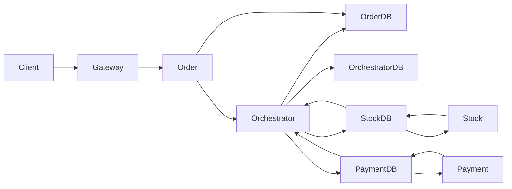

# Architecture Guide

This repository now uses an extracted `orchestrator-service` plus Redis Streams.

## High-Level Picture

## Service Responsibilities

| Component | Responsibility | Main files |
| --- | --- | --- |
| `gateway` | Public ingress and HTTP routing | `gateway_nginx.conf`, `docker-compose.yml` |
| `order-service` | External order API, order storage, checkout request wait path | `order/app.py` |
| `orchestrator-service` | Starts transactions, consumes participant events, runs Saga or 2PC state machines, recovery | `orchestrator/app.py`, `orchestrator/streams_worker.py`, `orchestrator/protocols/` |
| `stock-service` | Owns item stock and stock-side participant logic | `stock/app.py`, `stock/streams_worker.py`, `stock/transaction_modes/`, `stock/ledger.py` |
| `payment-service` | Owns user credit and payment-side participant logic | `payment/app.py`, `payment/streams_worker.py`, `payment/transactions_modes/`, `payment/ledger.py` |
| `order-db` | Order objects and user-facing order status | `env/order_redis.env`, `docker-compose.yml` |
| `orchestrator-db` | Saga records, 2PC state, active transaction claims | `env/orchestrator_redis.env`, `orchestrator/protocols/` |
| `stock-db` | Stock data, stock command stream, stock event stream, stock ledger | `stock/app.py`, `stock/ledger.py` |
| `payment-db` | Payment data, payment command stream, payment event stream, payment ledger | `payment/app.py`, `payment/ledger.py` |

## Important Repository Paths

### Current hot path

- `order/app.py`
  Thin HTTP facade for order CRUD and checkout.
- `orchestrator/app.py`
  Thin HTTP facade for `POST /transactions/checkout`.
- `orchestrator/streams_worker.py`
  Redis Streams wiring for the coordinator.
- `orchestrator/protocols/saga/saga.py`
  Saga state machine and recovery entry points.
- `orchestrator/protocols/saga/saga_record.py`
  Durable saga record storage and dedup metadata.
- `orchestrator/protocols/two_pc.py`
  2PC coordinator, decision logic, active transaction claims, recovery.
- `stock/streams_worker.py`
  Stock command consumption, orphan recovery, unreplied-event replay.
- `payment/streams_worker.py`
  Payment command consumption, orphan recovery, unreplied-event replay.
- `stock/ledger.py`
  Crash-safe local ledger for stock participant actions.
- `payment/ledger.py`
  Crash-safe local ledger for payment participant actions.
- `common/messages.py`
  Shared message types, status constants, and builders.
- `common/streams_client.py`
  Redis Streams abstraction used by all services.

### Infrastructure and runtime config

- `docker-compose.yml`
  Local deployment topology, restart policy, worker counts, health checks.
- `gateway_nginx.conf`
  HTTP ingress and keepalive settings.
- `env/*.env`
  Per-service Redis connection config and `TRANSACTION_MODE`.

### Removed phase-1 coordinator code

The old order-owned coordinator files were removed during cleanup. The source of
truth for distributed transaction logic is now only:

- `orchestrator/streams_worker.py`
- `orchestrator/protocols/saga/`
- `orchestrator/protocols/two_pc.py`

## Data Ownership

### `order-db`

- `<order_id>`: msgpack-encoded order object
- `order:<order_id>:status`: user-facing transaction status
- `order:<order_id>:tx_id`: current transaction pointer mirrored for polling/debugging

### `orchestrator-db`

- `saga:record:<tx_id>`: durable saga record
- `saga:active:<order_id>`: active saga transaction for an order
- `saga:seen:<message_id>`: dedup marker for saga events
- `order:<order_id>:2pcstate`: 2PC coordinator hash
- `2pc:active:<order_id>`: active 2PC transaction claim
- `order:<order_id>:status`: mirrored 2PC status
- `order:<order_id>:tx_id`: mirrored 2PC transaction id

### `stock-db`

- `<item_id>`: stock/price hash
- `stock.commands`, `stock.events`: Redis Streams
- `stock:ledger:<tx_id>:<action_type>`: stock participant ledger

### `payment-db`

- `<user_id>`: current credit
- `payment.commands`, `payment.events`: Redis Streams
- `payment:ledger:<tx_id>:<action_type>`: payment participant ledger

## Why the Orchestrator Is Separate Now

The biggest phase-2 change is that transaction coordination moved out of
`order-service`.

Before:

- `order-service` owned the protocol state machine
- `order-service` owned the message transport wiring
- transaction logic and public HTTP logic were tightly coupled

Now:

- `order-service` owns only the external API and order data
- `orchestrator-service` owns distributed transaction coordination
- protocol code is isolated behind `orchestrator/protocols/`
- the orchestrator can be evolved into a reusable software artifact

That separation matters because it reduces coupling and makes the design match
the deliverable for phase 2 much more closely.

## Checkout Flow

### Shared entry path

1. Client calls `POST /orders/checkout/<order_id>` through the gateway.
2. `order-service` loads the order and current status from `order-db`.
3. If the order is already in progress, `order-service` waits on `order:<id>:status`.
4. Otherwise `order-service` calls `POST /transactions/checkout` on the orchestrator.
5. The orchestrator stores coordinator state and publishes commands through Redis Streams.
6. `stock-service` and `payment-service` consume commands from their own Redis.
7. Participant services publish result events to their local event streams.
8. The orchestrator consumes those events, advances the protocol, and mirrors status to `order-db`.
9. `order-service` keeps polling `order:<id>:status` until success or failure.

### Saga path

1. Create saga record in `orchestrator-db`.
2. Publish `RESERVE_STOCK`.
3. On `STOCK_RESERVED`, transition to `PROCESSING_PAYMENT`.
4. On `PAYMENT_SUCCESS`, mark `completed`.
5. On `PAYMENT_FAILED`, transition to `compensating` and publish `RELEASE_STOCK`.
6. On `STOCK_RELEASED`, mark `failed`.

### 2PC path

1. Atomically claim `2pc:active:<order_id>` in `orchestrator-db`.
2. Create `order:<order_id>:2pcstate` plus mirrored status.
3. Publish `PREPARE_STOCK` and `PREPARE_PAYMENT`.
4. Wait until both participants are ready or one fails.
5. Publish `COMMIT_*` or `ABORT_*`.
6. Wait until both commit or abort confirmations arrive.
7. Mark final status and clear the active transaction claim.

## Redis Streams Transport

Important ideas:

- `stock.commands` and `stock.events` live in `stock-db`
- `payment.commands` and `payment.events` live in `payment-db`
- workers consume with consumer groups
- messages stay in the Pending Entries List until acknowledged
- orphaned messages are reclaimed with `XAUTOCLAIM`
- messages are batched to reduce round trips
- payloads are msgpack-encoded for lower overhead than JSON

This is a good fit for the project because it keeps the transport lightweight
while still giving durable queues, redelivery, consumer groups, and replay.

## Fault Tolerance and Edge Cases

### Duplicate checkout requests

- Saga uses `saga:active:<order_id>`.
- 2PC now uses `2pc:active:<order_id>`.
- Concurrent checkout requests for the same order cannot start two active
  transactions for the same protocol.

### Duplicate or replayed commands

- Stock and payment use local ledgers keyed by `(tx_id, action_type)`.
- `SET NX` prevents re-applying the same command after retries or replays.

### Duplicate or stale events

- Saga tracks `saga:seen:<message_id>` for deduplication.
- Saga and 2PC both compare incoming `tx_id` to the active transaction id.
- Events from an old transaction are ignored instead of reviving stale state.

### Crash after business effect but before reply publish

- Participant ledgers have three states: `received`, `applied`, `replied`.
- On restart, unreplied `applied` entries are re-published to the event stream.
- This closes the classic "effect committed but reply lost" gap.

### Crash after read but before ack

- Redis Streams keeps the message in the Pending Entries List.
- Workers drain their own PEL on startup.
- Separate orphan-recovery threads claim old pending entries from crashed workers.

### Orchestrator crash mid-transaction

- Saga recovery scans active saga records and resumes unfinished work.
- 2PC recovery scans `order:*:2pcstate` and republishes commit or abort messages
  when needed.
- Active transaction claims are restored for incomplete 2PC transactions and
  cleared for terminal ones.

### Uncertain HTTP start

- `order-service` no longer treats one failed POST to the orchestrator as a
  definite checkout failure.
- It re-reads `order:<id>:status`, retries once, and if the transaction is
  already in progress it waits for the terminal result.

## Docker and Deployment Changes

Compared with the earlier order-owned coordinator design, the Compose topology
changed in important ways:

- added `orchestrator-service`
- added `orchestrator-db`
- made `order-service` depend on the orchestrator
- enabled `restart: unless-stopped` across services
- added health checks so startup ordering is less chaotic
- used Redis AOF with `appendfsync everysec` for durability with better write
  throughput than `always`
- increased `nofile` limits and enabled connection reuse at the gateway
- exposed worker count and stream batch size through env vars

## Performance Notes

Why the current version performs better than a purely synchronous design:

- checkout coordination is event-driven instead of REST chaining between services
- stock and payment publish locally to their own Redis instead of cross-service
  writes for every event
- order-service is thinner and does less protocol work on the request path
- worker pools process messages concurrently
- batching and msgpack reduce per-message overhead
- gateway keepalive reduces repeated TCP setup cost

Your numbers make sense:

- 2PC with logs: around 300 RPS
- 2PC without logs: around 480 RPS
- Saga with logs: around 470 RPS
- Saga without logs: around 600-700 RPS

That pattern is expected because:

- verbose access logs add synchronous I/O on the hot path
- worker log formatting adds CPU overhead
- Docker Desktop log collection is not free
- Saga has less coordination overhead than 2PC

## Test Modules

The current Streams-oriented test modules are:

- `test/test_streams_simple.py`
- `test/test_streams_saga.py`
- `test/test_streams_saga_databases.py`
- `test/test_2pc.py`
- `test/test_2pc_databases.py`
