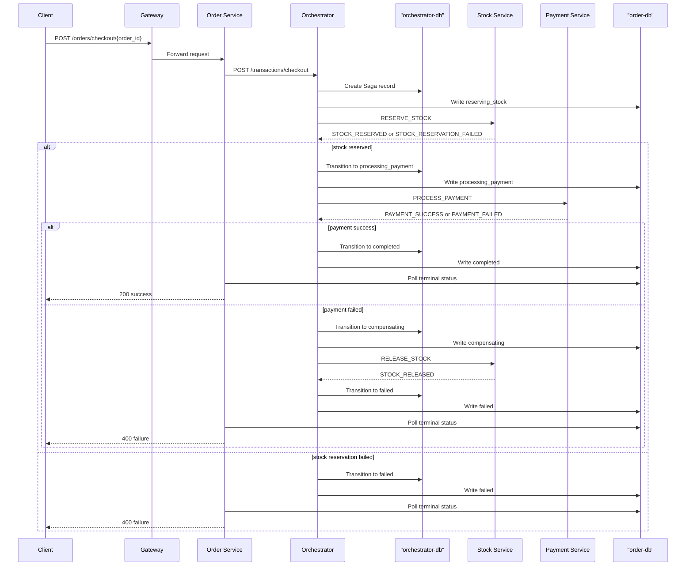
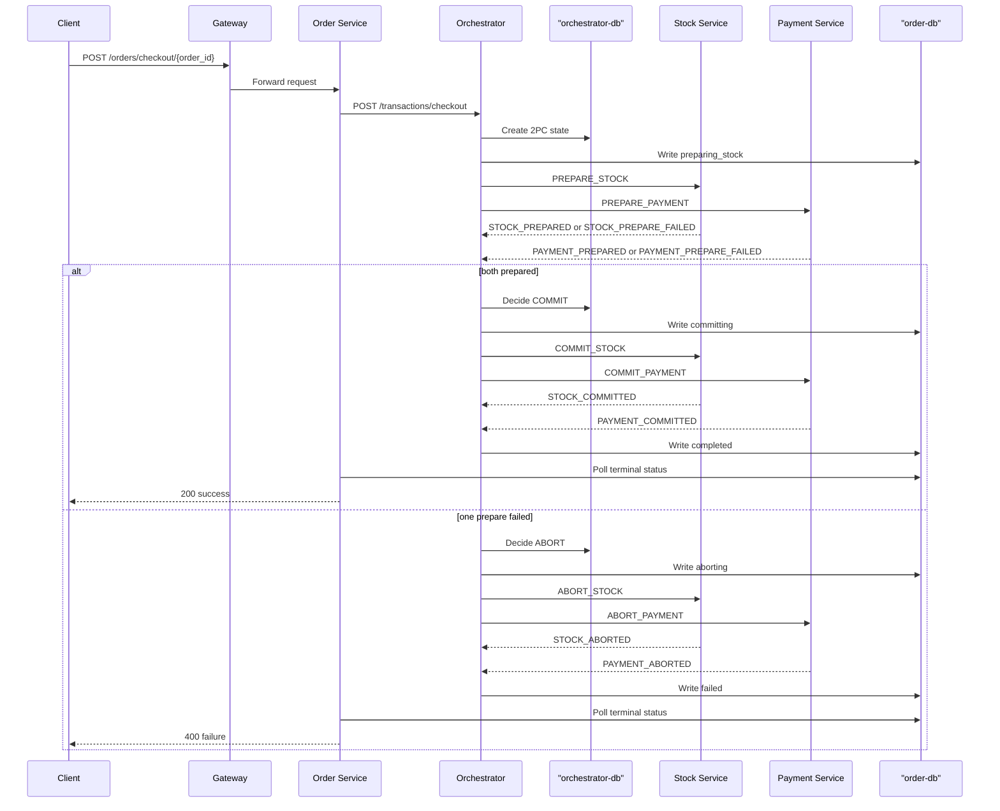

# DDS26 Team 19 explanation current Architecture

## 1. What this repository implements

The system is a shopping-cart microservice application with four runtime services:

- `gateway` (Nginx): public entrypoint on port `8000`
- `order-service`: external order API, stores orders, waits for final checkout result
- `orchestrator-service`: owns the distributed transaction logic
- `stock-service`: owns stock data and stock-side transaction effects
- `payment-service`: owns user credit data and payment-side transaction effects

Each domain service owns its own Redis:

- `small`: `order-db`, `orchestrator-db`, `stock-db`, `payment-db`
- `medium` / `large`: those same primaries plus `*-replica` containers and shared `redis-sentinel-1/2/3`

This still matches the decentralized data-management requirement: there is no single shared business database. Each bounded context owns one logical Redis store. In `small` that logical store is one container; in `medium` and `large` it is a primary/replica group.

All application code goes through [`common/redis_client.py`](common/redis_client.py). In `small`, that helper returns a direct Redis client using `*_REDIS_HOST`. In `medium` and `large`, it asks Sentinel which replica is currently primary and reconnects there.

## 2. Where to start reading

If someone on the team only has 20 minutes, read these files in this order:

1. [`common/messages.py`](common/messages.py)
2. [`common/redis_client.py`](common/redis_client.py)
3. [`order/app.py`](order/app.py)
4. [`orchestrator/app.py`](orchestrator/app.py)
5. [`orchestrator/streams_worker.py`](orchestrator/streams_worker.py)
6. [`orchestrator/leader_lease.py`](orchestrator/leader_lease.py)
7. [`orchestrator/protocols/saga/saga.py`](orchestrator/protocols/saga/saga.py)
8. [`orchestrator/protocols/saga/saga_record.py`](orchestrator/protocols/saga/saga_record.py)
9. [`orchestrator/protocols/two_pc.py`](orchestrator/protocols/two_pc.py)
10. [`stock/ledger.py`](stock/ledger.py) and [`payment/ledger.py`](payment/ledger.py)
11. [`stock/streams_worker.py`](stock/streams_worker.py) and [`payment/streams_worker.py`](payment/streams_worker.py)

## 3. Shared message protocol

[`common/messages.py`](common/messages.py#L23) is the protocol contract used by every service.

Important things defined there:

- topic ownership:
  - `stock.commands`
  - `stock.events`
  - `payment.commands`
  - `payment.events`
- user-facing order states:
  - `SagaOrderStatus`
  - `TwoPhaseOrderStatus`
- all command/event type constants
- message builders such as:
  - `build_reserve_stock(...)`
  - `build_process_payment(...)`
  - `build_prepare_stock(...)`
  - `build_commit_payment(...)`

The important design choice is that the transport shape is centralized here, but the coordination logic is not. The protocol logic lives in the orchestrator.

## 3A. Redis deployment layer

The database layer is worth understanding on its own because it changes both the runtime topology and the failure story.

How it works:

- `small` keeps one Redis primary per bounded context
- `medium` and `large` add one Redis replica per bounded context
- `medium` and `large` run three shared Sentinel processes that monitor all four primaries
- services use [`common/redis_client.py`](common/redis_client.py) in both cases: direct-host mode in `small`, Sentinel-discovery mode in the HA profiles

Why this helps:

- `small` stays compliant with the assignment requirement for one instance of each app service, database, and queue
- in `medium` and `large`, killing a Redis primary no longer forces a manual config change in the clients
- in `medium` and `large`, a promoted replica can become the new write target automatically
- the service-level recovery logic can keep working even while the database role changes underneath it

What it does not magically solve:

- Redis replication is asynchronous in the HA profiles, so the very latest writes can still be at risk during failover
- that is why the project still relies on idempotent ledgers, durable order status, replayable stream work, and orchestrator recovery logic

## 4. External request flow

Checkout flow, end to end:

1. Client calls `POST /orders/checkout/<order_id>` on the gateway.
2. Gateway routes to `order-service`.
3. [`order/app.py`](order/app.py#L270) validates the order and calls the orchestrator through `POST /transactions/checkout`.
4. [`orchestrator/app.py`](orchestrator/app.py#L50) does not finish the transaction itself; it only starts Saga or 2PC work inside the orchestrator runtime.
5. The orchestrator publishes commands to `stock.commands` and `payment.commands`.
6. Stock/payment workers apply local business changes and publish reply events.
7. Orchestrator event workers consume those events and advance the transaction state machine.
8. Orchestrator writes `order:<order_id>:status` into the current `order-db` primary.
9. `order-service` keeps polling that shared status until it becomes terminal, then returns `200` or `400`.

Why this matters:

- the HTTP response is delayed until durable terminal state is visible in `order-db`
- this avoids the old bug where one order replica received the HTTP request and another replica consumed the final event
- it also matches the consistency harness better because the externally visible result follows the durable status

Small-profile note:

- the `small` profile keeps one instance of each application service, database, and queue
- that single `order-service` talks directly to the single `order-db` container

The important code is:

- [`order/app.py#L130`](order/app.py#L130): `_poll_for_terminal_status(...)`
- [`order/app.py#L175`](order/app.py#L175): `_resolve_uncertain_checkout_start(...)`
- [`order/app.py#L270`](order/app.py#L270): `checkout(...)`

## 5. Order service

`order-service` is intentionally thin. It owns order contents, but not the distributed transaction protocol.

Key functions:

- [`order/app.py#L185`](order/app.py#L185): `create_order(...)`
- [`order/app.py#L222`](order/app.py#L222): `find_order(...)`
- [`order/app.py#L236`](order/app.py#L236): `order_status(...)`
- [`order/app.py#L251`](order/app.py#L251): `add_item(...)`
- [`order/app.py#L270`](order/app.py#L270): `checkout(...)`

What to remember for the interview:

- `order-service` persists the order payload itself
- checkout status is stored separately as `order:<order_id>:status`
- `checkout()` is defensive against orchestrator uncertainty:
  - if it gets a network failure or `5xx`, it does not immediately assume failure
  - it first checks whether the orchestrator actually started the transaction and then waits on durable status

That is the reason the system behaves well when an orchestrator replica dies mid-load.

## 6. Orchestrator HTTP layer vs orchestrator runtime

The orchestrator has two layers:

### Thin HTTP facade

[`orchestrator/app.py#L50`](orchestrator/app.py#L50) exposes `POST /transactions/checkout`.

This layer:

- validates the request
- checks readiness through `is_available()`
- calls `start_checkout(...)`
- returns immediately after the coordinator state is created

It does not directly talk to stock or payment over REST.

### Runtime / worker layer

[`orchestrator/streams_worker.py#L224`](orchestrator/streams_worker.py#L224) is the real runtime:

- initializes Redis connections through [`common/redis_client.py`](common/redis_client.py)
- ensures Redis consumer groups exist
- starts event consumers for `stock.events` and `payment.events`
- starts orphan recovery workers for pending stream entries
- starts the timeout/recovery loop
- dispatches the chosen protocol:
  - Saga
  - 2PC

Important functions:

- [`orchestrator/streams_worker.py#L224`](orchestrator/streams_worker.py#L224): `init_streams(...)`
- [`orchestrator/streams_worker.py#L202`](orchestrator/streams_worker.py#L202): `_recovery_loop(...)`
- [`orchestrator/streams_worker.py#L319`](orchestrator/streams_worker.py#L319): `start_checkout(...)`

## 7. Leader election and why it exists

Medium and large now run multiple orchestrator replicas. That creates a coordination problem: some work is safe to do on every replica, and some work must only be done by one replica.

Safe on every replica:

- accept `POST /transactions/checkout`
- consume `stock.events`
- consume `payment.events`

Must be singleton:

- startup recovery
- periodic timeout scanning
- 2PC incomplete transaction recovery

That is handled by [`orchestrator/leader_lease.py`](orchestrator/leader_lease.py):

- [`orchestrator/leader_lease.py#L50`](orchestrator/leader_lease.py#L50): `init_lease(...)`
- [`orchestrator/leader_lease.py#L70`](orchestrator/leader_lease.py#L70): `is_leader()`
- [`orchestrator/leader_lease.py#L75`](orchestrator/leader_lease.py#L75): `release_lease()`

Mechanics:

- a replica tries `SET orchestrator:leader <instance_id> NX EX 15`
- if it wins, it is leader
- a daemon renew loop refreshes the TTL every 5 seconds
- if the leader dies, its lease expires and another replica takes over
- because the lease itself lives in the `orchestrator-db` replication group, leadership also survives a database primary promotion as long as Redis remains available through Sentinel

Important hardening that was added:

- on Redis errors, the lease holder steps down immediately instead of pretending it is still leader
- lease release uses atomic compare-and-delete Lua, not a racey `GET` then `DEL`

Where leadership is enforced:

- [`orchestrator/streams_worker.py#L202`](orchestrator/streams_worker.py#L202): only the leader runs `_recovery_loop(...)`
- [`orchestrator/streams_worker.py#L224`](orchestrator/streams_worker.py#L224): only the leader runs startup recovery inside `init_streams(...)`

## 8. Saga mode

Saga coordinator entrypoint:

- [`orchestrator/protocols/saga/saga.py#L63`](orchestrator/protocols/saga/saga.py#L63): `saga_start_checkout(...)`

Saga event router:

- [`orchestrator/protocols/saga/saga.py#L127`](orchestrator/protocols/saga/saga.py#L127): `saga_route_order(...)`

Saga recovery:

- [`orchestrator/protocols/saga/saga.py#L295`](orchestrator/protocols/saga/saga.py#L295): `recover(...)`
- [`orchestrator/protocols/saga/saga.py#L322`](orchestrator/protocols/saga/saga.py#L322): `check_timeouts(...)`

Saga state progression:

- `RESERVING_STOCK`
- `PROCESSING_PAYMENT`
- `COMPENSATING`
- `COMPLETED` or `FAILED`

Important design points:

- stock is reserved first
- payment is charged second
- if payment fails, stock is compensated with `RELEASE_STOCK`
- there is no “charge first, maybe refund later” normal path

This is why a failed checkout should not lose money.

Saga success/failure sequence:



## 9. Durable Saga record model

Saga state is persisted in [`orchestrator/protocols/saga/saga_record.py`](orchestrator/protocols/saga/saga_record.py), not in memory.

Most important functions:

- [`orchestrator/protocols/saga/saga_record.py#L81`](orchestrator/protocols/saga/saga_record.py#L81): `load_event_context(...)`
- [`orchestrator/protocols/saga/saga_record.py#L134`](orchestrator/protocols/saga/saga_record.py#L134): `transition(...)`
- [`orchestrator/protocols/saga/saga_record.py#L253`](orchestrator/protocols/saga/saga_record.py#L253): `create_if_no_active(...)`
- [`orchestrator/protocols/saga/saga_record.py#L318`](orchestrator/protocols/saga/saga_record.py#L318): `clear_active_tx_id(...)`

What each one does:

- `create_if_no_active(...)`
  - enforces one active transaction per order
  - uses Redis `WATCH/MULTI/EXEC`
- `load_event_context(...)`
  - reads the dedup key, active tx pointer, and saga record in one round-trip
- `transition(...)`
  - atomically updates the saga record and timeout indexes
  - if `message_id` is provided, it also marks the event as seen in the same pipeline
- `clear_active_tx_id(...)`
  - removes `saga:active:<order_id>` only if it still points at the same `tx_id`

That last part matters because it prevents stale cleanup from deleting a newer active transaction.

## 10. 2PC mode

2PC coordinator entrypoints:

- [`orchestrator/protocols/two_pc.py#L499`](orchestrator/protocols/two_pc.py#L499): `_2pc_start_checkout(...)`
- [`orchestrator/protocols/two_pc.py#L548`](orchestrator/protocols/two_pc.py#L548): `_2pc_route_order(...)`
- [`orchestrator/protocols/two_pc.py#L374`](orchestrator/protocols/two_pc.py#L374): `recover_incomplete_2pc()`

Design summary:

- prepare stock
- prepare payment
- if both are ready, decide commit
- if either fails, decide abort
- wait for both participants to confirm commit or abort
- finish by writing final order status and clearing active state

Why this implementation is robust:

- participant/deci­sion transitions are guarded by Lua scripts, not ad-hoc multi-step reads and writes
- the coordinator keeps a bounded recovery set `2pc:incomplete`
- recovery rebuilds missing prepare/commit/abort messages from durable state

2PC success/failure sequence:



## 11. Participant services: stock and payment

Both participant services follow the same pattern:

1. API layer owns local CRUD endpoints
2. stream worker consumes commands from its own Redis stream
3. protocol router applies business effect
4. participant ledger makes replay idempotent
5. reply event is published back to the orchestrator

### Stock service

API and local data:

- [`stock/app.py`](stock/app.py)
- [`stock/app.py#L71`](stock/app.py#L71): `apply_stock_delta(...)`

Stream runtime:

- [`stock/streams_worker.py#L42`](stock/streams_worker.py#L42): `_replay_unreplied_entries(...)`
- [`stock/streams_worker.py#L135`](stock/streams_worker.py#L135): `init_streams(...)`

Protocol handlers:

- [`stock/transaction_modes/saga.py#L172`](stock/transaction_modes/saga.py#L172): `saga_route_stock(...)`
- [`stock/transaction_modes/saga.py#L254`](stock/transaction_modes/saga.py#L254): `_reserve_stock_atomically(...)`
- [`stock/transaction_modes/saga.py#L283`](stock/transaction_modes/saga.py#L283): `_release_stock_atomically(...)`
- [`stock/transaction_modes/two_pc.py#L557`](stock/transaction_modes/two_pc.py#L557): `_2pc_route_stock(...)`

### Payment service

API and local data:

- [`payment/app.py`](payment/app.py)
- [`payment/app.py#L57`](payment/app.py#L57): `remove_credit_internal(...)`
- [`payment/app.py#L70`](payment/app.py#L70): `add_credit_internal(...)`

Stream runtime:

- [`payment/streams_worker.py#L36`](payment/streams_worker.py#L36): `_replay_unreplied_entries(...)`
- [`payment/streams_worker.py#L127`](payment/streams_worker.py#L127): `init_streams(...)`

Protocol handlers:

- [`payment/transactions_modes/saga.py#L149`](payment/transactions_modes/saga.py#L149): `saga_route_payment(...)`
- [`payment/transactions_modes/two_pc.py#L529`](payment/transactions_modes/two_pc.py#L529): `_2pc_route_payment(...)`

## 12. Participant ledgers and idempotency

The participant ledgers are the main reason the system survives retries and duplicate messages safely.

Important files:

- [`stock/ledger.py`](stock/ledger.py)
- [`payment/ledger.py`](payment/ledger.py)

Important functions:

- `create_entry(...)`
- `mark_applied(...)`
- `mark_replied(...)`
- `get_unreplied_entries(...)`

The local ledger state machine is:

- `received`
- `applied`
- `replied`

Why it matters:

- if a command is replayed, the service can see it already handled that `(tx_id, action_type)`
- if the service crashes after applying the business effect but before publishing the reply event, startup recovery republishes the saved reply message

This is exactly the failure pattern the assignment warns about.

## 13. Redis streams and orphan recovery

Every service that consumes a stream does three things:

1. drains its own pending entries list first
2. consumes new messages with consumer groups
3. runs an orphan recovery worker using `XAUTOCLAIM`

That means:

- if one worker crashes after reading but before acking, the message is not lost
- if a whole container dies, another worker can reclaim that stuck pending message later

The orchestrator, stock, and payment workers all follow this pattern in their `streams_worker.py` modules.

## 14. Why the deployment profiles scale better now

The original bottlenecks were:

- all replicated `order-service` instances still called one orchestrator container
- clients were tied too closely to fixed Redis hosts instead of logical primaries

The current fix is:

- every bounded context now uses the shared Redis client abstraction for direct-host or Sentinel-backed primary discovery
- `small` stays single-instance per application service to match the low-scale deployment requirement
- medium and large run multiple orchestrator replicas
- order-service calls the orchestrator through the gateway’s internal `/orchestrator/` upstream
- event workers run on every orchestrator replica
- only recovery/timeout scanning is singleton via the lease

This is why the scaled profiles behave better under both throughput tests and injected failures.

## 15. Expected behavior under failures

What we want to see under that test:

- consistency remains correct
- a short latency spike is acceptable
- a short throughput dip is acceptable
- recovery should happen automatically
- long periods of `5xx` or permanent stuck transactions are not acceptable
- after a Redis primary failure, clients should reconnect to the promoted replica through Sentinel without editing configuration by hand

What we observed during local tests:

- killing orchestrator PID 1 causes a brief latency spike
- the container restarts
- another orchestrator replica can take leadership if needed
- in-flight Saga transactions are recovered and replayed
- killing a Redis primary causes a short failover window, then Sentinel promotes the replica and clients resume through the new primary
- after the gateway retry changes, failover behavior is much cleaner than before

Zero downtime is a stretch goal, not the minimum passing behavior.

## 16. How to run the project now

The `Makefile` now supports protocol-specific startup without editing `env/transaction.env`.

Main targets:

- [`Makefile#L49`](Makefile#L49): `small-up-saga`
- [`Makefile#L52`](Makefile#L52): `small-up-2pc`
- [`Makefile#L76`](Makefile#L76): `medium-up-saga`
- [`Makefile#L79`](Makefile#L79): `medium-up-2pc`
- [`Makefile#L103`](Makefile#L103): `large-up-saga`
- [`Makefile#L106`](Makefile#L106): `large-up-2pc`
- [`Makefile#L109`](Makefile#L109): `unit-saga`
- [`Makefile#L118`](Makefile#L118): `unit-2pc`
- [`Makefile#L126`](Makefile#L126): `consistency`
- [`Makefile#L129`](Makefile#L129): `stress-init`
- [`Makefile#L135`](Makefile#L135): `stress-headless`

Useful command examples:

```bash
make small-up-saga
make unit-saga
make small-down

make small-up-2pc
make unit-2pc
make small-down

make medium-up-saga
make consistency
make stress-init
make stress-headless
make medium-down

make large-up-saga
make consistency
make large-down
```

Interactive Locust UI:

```bash
make stress-init
make stress-locust
```

Headless Locust with defaults:

```bash
make stress-headless
```

Headless Locust with custom values:

```bash
make stress-headless LOCUST_USERS=1000 LOCUST_RATE=100 LOCUST_RUNTIME=60s
```

## 17. Fault-injection commands

```bash
docker compose -p dds-medium -f docker/compose/docker-compose.medium.yml exec -T orchestrator-service sh -lc 'kill 1'
```

or:

```bash
docker compose -p dds-medium -f docker/compose/docker-compose.medium.yml exec -T orchestrator-service-2 sh -lc 'kill 1'
```

Useful workflow for a live demo:

```bash
make medium-up-saga
make stress-init
make stress-headless LOCUST_USERS=1000 LOCUST_RATE=100 LOCUST_RUNTIME=60s
```

During the Locust run, kill one orchestrator replica as above.

What you should expect:

- a brief latency spike
- maybe a brief throughput dip
- container restart
- consistency preserved
- no long outage

If you want to confirm leadership movement, inspect the orchestrator logs for `[LeaderLease] acquired leader lease`.

## 18. What is still imperfect

The most important remaining bottlenecks are:

- `gateway` is still a single ingress point
- `orchestrator-db` is still a single Redis write hotspot
- `order-db` is still a shared status-polling hotspot
- large may not beat medium on a laptop because Docker Desktop overhead hides scaling gains

These are not correctness bugs. They are the next scalability ceiling.

## 19. questions to know

1. Why does `order-service` poll durable order status instead of waiting on in-memory state?
2. Why is the orchestrator split into an HTTP facade plus a stream-processing runtime?
3. Why can multiple orchestrators consume events, but only one can run recovery and timeout scanning?
4. How do the participant ledgers make retries and crashes safe?
5. What is the exact difference between Saga compensation and 2PC prepare/commit/abort?
6. What happens when a container dies after applying a local change but before sending its reply event?
7. Why does large not necessarily scale linearly even if it has more CPUs?
