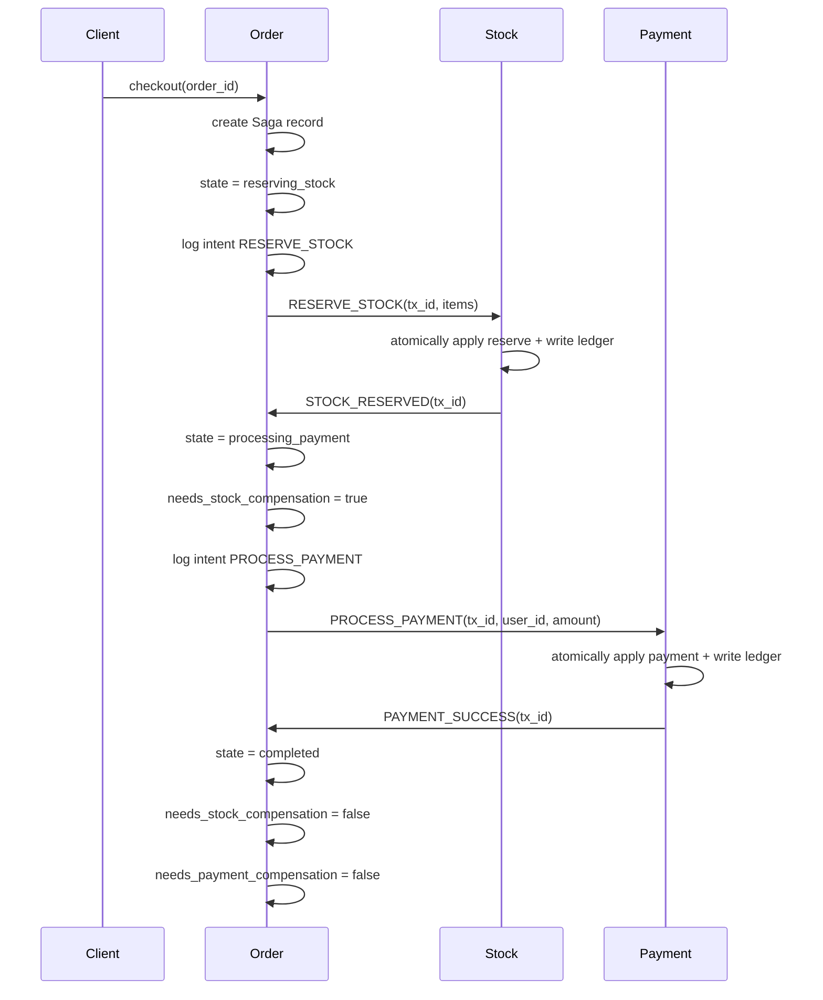
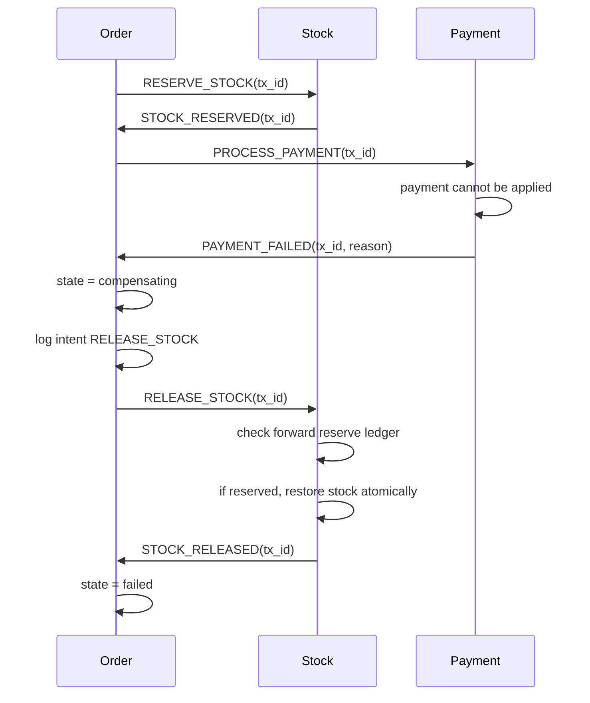

# Final Orchestrated Kafka Saga Plan

## 1. Final Decision

This document freezes the approach we want to build first.

We will implement:

- an orchestrated Saga
- over Kafka
- with the order service as orchestrator
- with a durable Saga record in the order service
- with durable participant ledgers in stock and payment
- with idempotency keyed by `(tx_id, action_type)` at participants
- with conservative replay on recovery

We will **not** make verification the core design right now.

Side note:

- verification can be added later for special ambiguous recovery cases
- but it is not needed for the first correct implementation

This document is the final "how we will do it" note before coding.

## 2. Scope of the First Correct Version

For the first real Saga version, we want:

- correct happy path
- correct normal failure compensation
- correct restart recovery after one service/container crash
- duplicate-safe commands and events
- timeout-driven recovery

We do **not** need, in the first version:

- a fully general query/verification protocol
- a huge event-sourced system
- a separate external orchestrator service
- 2PC behavior

## 3. Why This Approach

This approach is the best fit for the repo because:

- the order service already starts checkout
- the order service already consumes stock and payment events
- Kafka is already the communication backbone
- correctness is more important than shaving off a few local Redis writes
- participant-local ledgers solve the professor's biggest concern: "what did this service already do?"

This approach gives a good balance:

- correctness: high
- performance: still good on the happy path
- complexity: medium, but manageable
- explainability: high

## 4. Core Principle

The whole design is built around one rule:

> No service should ever need to guess what it already did.

That means:

- the order service must durably remember Saga progress
- stock must durably remember whether it already handled reserve/release for a given transaction
- payment must durably remember whether it already handled pay/refund for a given transaction

If a service restarts, it should inspect durable local state and continue safely.

## 5. IDs We Will Use

We already have the right basic IDs. We just need to use them consistently.

## 5.1 `order_id`

Meaning:

- identifies the business order

Usage:

- lookup order data
- tie a Saga to the order

## 5.2 `tx_id`

Meaning:

- identifies one checkout attempt / one Saga instance

Usage:

- all messages in one Saga share the same `tx_id`
- participant ledgers are keyed from it
- recovery logic reasons about the Saga through it

Important rule:

- if the same order is ever checked out again as a fresh attempt, it must get a new `tx_id`

## 5.3 `message_id`

Meaning:

- identifies one Kafka message

Usage:

- event dedupe
- tracing
- observability

Important rule:

- `message_id` is not enough for business idempotency
- participants must not use only `message_id` to decide whether an action already happened

## 5.4 Participant action key

We do not need a new global field for this.

We will derive a local key:

- `(tx_id, action_type)`

Examples:

- `(abc, RESERVE_STOCK)`
- `(abc, RELEASE_STOCK)`
- `(abc, PROCESS_PAYMENT)`
- `(abc, REFUND_PAYMENT)`

This is the participant's business idempotency key.

## 5.5 Local log row IDs

Each service can have local log row IDs or sequence numbers if needed for storage/debugging.

We do not need to expose them in Kafka messages.

## Recommended ID model

- global business object: `order_id`
- global Saga instance: `tx_id`
- per-message identity: `message_id`
- participant idempotency key: `(tx_id, action_type)`
- local log row ids only inside the service

## 6. Message Types We Will Use

We will reuse the existing message families.

## 6.1 Commands

### Order -> Stock

- `RESERVE_STOCK`
- `RELEASE_STOCK`

### Order -> Payment

- `PROCESS_PAYMENT`
- `REFUND_PAYMENT`

For the first normal path, `REFUND_PAYMENT` is mostly future-proofing.

Normal v1 flow should be:

- reserve stock first
- then process payment

That means the normal compensation path is:

- release stock on payment failure

`REFUND_PAYMENT` is still useful later if recovery reveals that payment succeeded but the Saga must still abort.

## 6.2 Events

### Stock -> Order

- `STOCK_RESERVED`
- `STOCK_RESERVATION_FAILED`
- `STOCK_RELEASED`

### Payment -> Order

- `PAYMENT_SUCCESS`
- `PAYMENT_FAILED`
- `PAYMENT_REFUNDED`

## 6.3 Message payload rules

### `RESERVE_STOCK`

Payload should include:

- `items`: list of `{item_id, quantity}`

### `RELEASE_STOCK`

Payload should include:

- `items`: list of `{item_id, quantity}`

### `PROCESS_PAYMENT`

Payload should include:

- `user_id`
- `amount`

### `REFUND_PAYMENT`

Payload should include:

- `user_id`
- `amount`

### Failure events

Failure events should always include:

- reason

This matters for debugging and for deciding what recovery should do.

## 7. Orchestrator Saga States

We keep the high-level state machine small, but we store extra fields in the Saga record to make recovery precise.

## 7.1 Main Saga states

| State | Meaning |
| --- | --- |
| `pending` | order exists, checkout not started |
| `reserving_stock` | stock reservation command is in flight / awaiting stock result |
| `processing_payment` | payment command is in flight / awaiting payment result |
| `compensating` | rollback/compensation command is in flight |
| `completed` | terminal success |
| `failed` | terminal failure |

## 7.2 Why this is enough

These states describe the phase of the Saga.

The exact detail of what needs compensation should not require exploding the state machine into many labels. Instead, we store extra fields in the Saga record.

## 7.3 Extra Saga record fields

The order service should store a durable Saga record like this:

| Field | Purpose |
| --- | --- |
| `tx_id` | current Saga instance |
| `order_id` | business order |
| `state` | one of the six Saga states |
| `user_id` | for payment steps |
| `amount` | total payment amount |
| `items` | collapsed item list for stock |
| `last_command_type` | most recent command the orchestrator intended/sent |
| `awaiting_event_type` | which event it is currently waiting for |
| `needs_stock_compensation` | whether stock must be released if aborting |
| `needs_payment_compensation` | whether payment must be refunded if aborting |
| `failure_reason` | most recent failure reason |
| `started_at_ms` | for auditing/recovery |
| `updated_at_ms` | for recovery |
| `timeout_at_ms` | deadline for waiting on the current step |
| `retry_count` | optional but useful |

## 7.4 Why the compensation flags matter

State alone is not enough.

Example:

- if stock has already been reserved, then a future abort must release stock
- if payment has already succeeded, then a future abort may need refund

That is why the Saga record should explicitly store compensation obligations.

## 8. Participant Local States

Participants do not need the same state names as the Saga.

For each participant ledger entry keyed by `(tx_id, action_type)`, we use local states describing local progress.

## 8.1 Recommended participant local states

| Local state | Meaning |
| --- | --- |
| `received` | command recognized and ledger entry created |
| `applied` | local business effect has been committed in the local DB |
| `replied` | result event has been published |

For some failure cases, `applied` can still be meaningful even if the business result is "failure with no business change", because it means the participant reached a stable local decision and stored the response to send.

### Recommended fields in each ledger entry

| Field | Purpose |
| --- | --- |
| `tx_id` | Saga instance |
| `action_type` | business step for this participant |
| `local_state` | `received`, `applied`, or `replied` |
| `result` | success / failure / noop |
| `response_event_type` | which event to emit or re-emit |
| `response_payload` | payload for the reply event |
| `business_snapshot` | enough local info to compensate or explain |
| `created_at_ms` | audit/recovery |
| `updated_at_ms` | audit/recovery |

## 8.2 Why store the response event data?

Because if the participant crashes after applying local state but before publishing the event, on restart it should be able to re-emit the same response safely.

That means the ledger should remember:

- what reply event to send
- with what payload

## 9. The Important Crash Question: Can We Crash After Apply But Before Marking Applied?

Yes, this can happen **if** you implement local business change and ledger update as separate operations.

Example bad design in payment:

1. subtract credit
2. then separately update ledger to say `applied`

If the process crashes between those two operations, recovery is in trouble:

- money may already be changed
- ledger may still say nothing happened

## 9.1 Can we prevent this?

Yes, locally we can and should prevent this.

Because stock and payment each use their own single local Redis instance, we can make:

- business state update
- plus participant ledger update

happen atomically as one local transaction.

## 9.2 What this means in practice

### Payment

For `PROCESS_PAYMENT`, do **not**:

1. change user credit
2. later store ledger state

Instead do them atomically in one local Redis transaction or script.

### Stock

For `RESERVE_STOCK`, the stock deductions for all items plus the ledger record must be committed atomically together in the stock service's local DB logic.

Because this is one Redis instance, this is possible.

## 9.3 What cannot be made atomic here?

Kafka event publishing is still separate from the local database transaction.

So even if we prevent:

- "applied but ledger not updated"

we still cannot prevent:

- "applied locally but event not yet published"

That remaining ambiguity is exactly why the participant ledger needs the `applied` state and stored reply event data.

So the local answer is:

- local DB effect + ledger update can be made atomic
- local DB effect + Kafka publish cannot be made atomic in this simple design

That is fine, because the ledger is what makes recovery safe.

## 10. Order Service Storage Design

The order service should store two things:

## 10.1 Current Saga record

One durable current-state record keyed by `tx_id` or `order_id`.

This is what recovery scans.

## 10.2 Append-only orchestration log

A lightweight append-only log of important moments:

- `SAGA_STARTED`
- `COMMAND_INTENT_LOGGED`
- `EVENT_RECEIVED`
- `STATE_TRANSITION`
- `RECOVERY_REPLAYED`
- `COMPENSATION_REQUESTED`

Why keep the log if the Saga record already exists?

- debugging
- recovery auditing
- proving what the orchestrator thought happened

But the current Saga record is the main thing recovery reads first.

## 11. Participant Ledger Design

Each participant should keep a ledger entry per `(tx_id, action_type)`.

## 11.1 Payment ledger entries

Examples:

- `(tx123, PROCESS_PAYMENT)`
- `(tx123, REFUND_PAYMENT)`

## 11.2 Stock ledger entries

Examples:

- `(tx123, RESERVE_STOCK)`
- `(tx123, RELEASE_STOCK)`

## 11.3 Why separate entries per action type?

Because the forward action and compensation are not the same thing.

Example:

- reserving stock is not the same as releasing stock
- processing payment is not the same as refunding payment

They need separate local records, even if they share the same `tx_id`.

## 12. Exact Happy-Path Flow

We choose:

1. reserve stock first
2. then process payment

This avoids needing payment refund in the normal failure case.

## 13. Exact Normal Failure Compensation Flow

This is the normal failure we care about first:

- stock reservation succeeded
- payment fails
- stock must be released

## 14. Exact Orchestrator Rules by Current Saga State

This is the rule section that should drive the code.

## 14.1 If Saga state is `pending`

Meaning:

- checkout not started yet

Allowed action:

- create Saga record
- move to `reserving_stock`
- publish `RESERVE_STOCK`

## 14.2 If Saga state is `reserving_stock`

Meaning:

- stock result is outstanding

Expected event:

- `STOCK_RESERVED` or `STOCK_RESERVATION_FAILED`

Recovery rule:

- if timeout or restart occurs, replay `RESERVE_STOCK`

Why replay is safe:

- stock participant dedupes using `(tx_id, RESERVE_STOCK)`

## 14.3 If Saga state is `processing_payment`

Meaning:

- payment result is outstanding

Expected event:

- `PAYMENT_SUCCESS` or `PAYMENT_FAILED`

Recovery rule:

- if timeout or restart occurs, replay `PROCESS_PAYMENT`

Why replay is safe:

- payment participant dedupes using `(tx_id, PROCESS_PAYMENT)`

## 14.4 If Saga state is `compensating`

Meaning:

- compensation result is outstanding

Expected event in v1:

- `STOCK_RELEASED`

Recovery rule:

- if timeout or restart occurs, replay `RELEASE_STOCK`

Why replay is safe:

- stock participant dedupes using `(tx_id, RELEASE_STOCK)`

## 14.5 If Saga state is `completed`

Meaning:

- terminal success

Recovery rule:

- do nothing

## 14.6 If Saga state is `failed`

Meaning:

- terminal failure

Recovery rule:

- do nothing

## 15. Exact Participant Rules by Action

This section is critical because the participant ledgers are the backbone of correctness.

## 15.1 Stock handling `RESERVE_STOCK`

Steps:

1. Build participant key `(tx_id, RESERVE_STOCK)`.
2. Read ledger entry.
3. If ledger state is `replied`, re-emit the stored event and stop.
4. If ledger state is `applied`, publish the stored event and then mark `replied`.
5. If no ledger entry exists:
6. Atomically validate stock for all items.
7. If validation fails, atomically write ledger entry with:
   - `local_state = applied`
   - `result = failure`
   - `response_event_type = STOCK_RESERVATION_FAILED`
   - `response_payload = reason`
8. If validation succeeds, atomically:
   - subtract stock for all items
   - write ledger entry with:
   - `local_state = applied`
   - `result = success`
   - `response_event_type = STOCK_RESERVED`
9. Publish the stored response event.
10. Mark ledger `local_state = replied`.

## 15.2 Stock handling `RELEASE_STOCK`

Steps:

1. Build participant key `(tx_id, RELEASE_STOCK)`.
2. Read compensation ledger entry.
3. If ledger state is `replied`, re-emit stored `STOCK_RELEASED` and stop.
4. If ledger state is `applied`, publish stored `STOCK_RELEASED` and then mark `replied`.
5. Read forward ledger entry `(tx_id, RESERVE_STOCK)`.
6. If forward entry shows reserve was never successfully applied:
   - create compensation ledger as a no-op success
   - response is still `STOCK_RELEASED`
7. If forward reserve succeeded and release not yet applied:
   - atomically restore stock
   - atomically write compensation ledger with `local_state = applied`
8. Publish stored `STOCK_RELEASED`
9. Mark compensation ledger `replied`

This is how stock safely answers the professor's question:

- "Did the original action really happen?"

It checks its own forward ledger.

## 15.3 Payment handling `PROCESS_PAYMENT`

Steps:

1. Build participant key `(tx_id, PROCESS_PAYMENT)`.
2. Read ledger entry.
3. If `replied`, re-emit stored event and stop.
4. If `applied`, publish stored event and then mark `replied`.
5. If no ledger entry exists:
6. Atomically:
   - validate user credit
   - if enough credit, subtract credit
   - write ledger entry with stored response event
7. If credit insufficient:
   - atomically write ledger entry with failure result and stored `PAYMENT_FAILED`
8. Publish stored response event.
9. Mark ledger `replied`.

## 15.4 Payment handling `REFUND_PAYMENT`

This is not central to v1, but we should still define it.

Steps:

1. Build participant key `(tx_id, REFUND_PAYMENT)`.
2. If compensation ledger is `replied`, re-emit `PAYMENT_REFUNDED`.
3. If compensation ledger is `applied`, publish `PAYMENT_REFUNDED` and mark `replied`.
4. Read forward ledger `(tx_id, PROCESS_PAYMENT)`.
5. If payment was never successfully applied:
   - write no-op success compensation ledger
6. If payment was successfully applied and refund not yet applied:
   - atomically add credit back
   - write compensation ledger as `applied`
7. Publish stored `PAYMENT_REFUNDED`
8. Mark compensation ledger `replied`

## 16. Event Dedupe Rules at the Orchestrator

The order service must dedupe incoming events.

Recommended rule:

- keep a processed-event set keyed by `message_id`

But do not rely only on message dedupe.

Also check:

- current Saga `tx_id`
- current Saga state

Examples:

- a duplicate `PAYMENT_FAILED` should not trigger two compensations
- a stale old `tx_id` event should be ignored
- a `PAYMENT_SUCCESS` that arrives while Saga is already `failed` should not move it back forward

## 17. Recovery Rules

Recovery should be simple and rule-based, not clever.

## 17.1 Recovery on order service startup

On startup, the order service should scan all non-terminal Saga records:

- `reserving_stock`
- `processing_payment`
- `compensating`

For each one:

- compare `timeout_at_ms` to current time
- if timed out or restart recovery is triggered, replay the expected command

## 17.2 Recovery on participant startup

On startup, a participant should scan ledger entries that are:

- `applied` but not `replied`

For each such entry:

- re-publish the stored response event
- mark it `replied`

This cleanly handles:

- local DB applied
- event not yet sent

## 17.3 Why replay is the main recovery tool

Replay is simpler than inference.

Because participants are idempotent, replaying:

- `RESERVE_STOCK`
- `PROCESS_PAYMENT`
- `RELEASE_STOCK`

is safe.

That means recovery does not need to guess as much.

## 17.4 Verification side note

Later, if needed, you can add optional verification for specific ambiguous cases:

- "Payment service, did tx X succeed?"
- "Stock service, was reserve for tx X applied?"

This is useful, but not required for the first correct build.

## 18. Timeout Rules

Timeouts are how the orchestrator decides a Saga may need recovery attention.

## 18.1 When to set timeouts

Whenever the Saga enters a waiting state:

- `reserving_stock`
- `processing_payment`
- `compensating`

the order service should store:

- `timeout_at_ms = now + timeout_duration`

## 18.2 What timeout means

Timeout does **not** mean:

- declare final failure immediately

Timeout means:

- the current expected event did not arrive in time
- replay or recovery action is needed

## 18.3 Recommended timeout policy

Simple v1 rule:

- if timed out in `reserving_stock`, replay `RESERVE_STOCK`
- if timed out in `processing_payment`, replay `PROCESS_PAYMENT`
- if timed out in `compensating`, replay `RELEASE_STOCK`

Optional:

- increment `retry_count`
- cap retries
- after too many retries, mark for operator attention or move to a manual-failure path

## 19. Edge Cases in This Chosen Design

This section revisits the important edge cases, now only in relation to the chosen approach.

## 19.1 Orchestrator crashes after logging intent but before publish

What recovery does:

- Saga state shows which phase was active
- `last_command_type` shows intended command
- order replays the command

Why safe:

- participant dedupes by `(tx_id, action_type)`

## 19.2 Orchestrator crashes after publish but before processing reply

What recovery does:

- same as above: replay

Why safe:

- participant either re-emits same result or ignores duplicate business effect

## 19.3 Participant crashes after local apply but before reply

What recovery does:

- participant ledger says `applied`, not `replied`
- on restart, participant re-emits stored response event

## 19.4 Duplicate command delivery

What handling does:

- participant sees existing ledger entry for `(tx_id, action_type)`
- does not apply effect again
- re-emits stored reply if needed

## 19.5 Duplicate event delivery

What handling does:

- order dedupes by `message_id`
- order also checks state/tx_id consistency

## 19.6 Compensation requested when forward action never happened

What handling does:

- participant checks forward ledger
- if forward action never succeeded, compensation becomes no-op success

This is correct and important.

## 19.7 Late stale event for older `tx_id`

What handling does:

- order compares event `tx_id` with active Saga `tx_id`
- if mismatch, ignore

## 20. Why This Design Solves the Professor's Concerns

The professor's key concerns were roughly:

- when do you log
- how do you know where to restart
- how do you know whether compensation is needed
- what if a service dies in the middle
- what if something was sent but maybe not applied

This design answers them as follows.

### "When do you log?"

- orchestrator logs intent before send
- participants atomically store local result before reply publish

### "How do you know where to restart?"

- the order service reads the Saga record state
- participants read local ledger states

### "How do you know whether compensation is needed?"

- orchestrator keeps compensation flags
- participants know whether the forward action actually happened

### "What if a service dies in the middle?"

- local DB effect + ledger state are atomic
- reply publication can be retried from the ledger

### "What if the command maybe was sent or maybe not?"

- replay is safe because participants are idempotent

## 21. Final Protocol Summary

This section compresses the design into one place.

## 21.1 Message types

Commands:

- `RESERVE_STOCK`
- `RELEASE_STOCK`
- `PROCESS_PAYMENT`
- `REFUND_PAYMENT`

Events:

- `STOCK_RESERVED`
- `STOCK_RESERVATION_FAILED`
- `STOCK_RELEASED`
- `PAYMENT_SUCCESS`
- `PAYMENT_FAILED`
- `PAYMENT_REFUNDED`

## 21.2 Saga states

- `pending`
- `reserving_stock`
- `processing_payment`
- `compensating`
- `completed`
- `failed`

## 21.3 Participant local states

- `received`
- `applied`
- `replied`

## 21.4 Orchestrator storage

- current Saga record
- append-only orchestration log
- processed event ids

## 21.5 Participant storage

- ledger entry per `(tx_id, action_type)`
- stored reply event data

## 21.6 Recovery rule

- replay the step implied by the current Saga state
- participant dedupe makes replay safe
- participant restart re-emits replies for `applied` but not `replied` entries

## 22. Step-by-Step Implementation Plan

This is the coding plan to follow incrementally.

## Step 0: Freeze the protocol

Before coding, write down and agree on:

- Saga states
- participant states
- ledger record fields
- replay rules
- timeout rules

This document is meant to serve that purpose.

## Step 1: Finalize shared message contract

Review `common/messages.py` and ensure the message types and payloads are exactly what the protocol needs.

At this stage, do not add extra fancy message types.

## Step 2: Add participant ledger helpers

Do this in stock and payment first.

Add helpers to:

- read/write ledger entries
- check `(tx_id, action_type)`
- store response event data

This is foundational.

## Step 3: Make participant local actions atomic

Before orchestrator recovery exists, make sure each participant can atomically:

- apply business change
- write ledger state/result

For stock, this is especially important because reservation touches multiple items.

## Step 4: Make participants replay-safe

Implement:

- if ledger `replied`, re-emit response
- if ledger `applied` but not `replied`, publish stored response and mark `replied`
- if no ledger, process normally

Do this for:

- `RESERVE_STOCK`
- `RELEASE_STOCK`
- `PROCESS_PAYMENT`

`REFUND_PAYMENT` can follow once the main path is stable.

## Step 5: Add order Saga record

In order service, add a durable Saga record that stores:

- state
- last command
- awaiting event
- compensation flags
- timeout

Do not jump straight to a huge state machine. First make the record shape correct.

## Step 6: Implement happy-path orchestrator

Make the order service:

- start the Saga
- persist `reserving_stock`
- publish `RESERVE_STOCK`
- on `STOCK_RESERVED`, move to `processing_payment`
- publish `PROCESS_PAYMENT`
- on `PAYMENT_SUCCESS`, mark `completed`

At this stage, keep focus narrow.

## Step 7: Implement normal failure compensation

Add:

- on `STOCK_RESERVATION_FAILED` -> `failed`
- on `PAYMENT_FAILED` -> `compensating` + publish `RELEASE_STOCK`
- on `STOCK_RELEASED` -> `failed`

This completes the normal failure path.

## Step 8: Add event dedupe and stale-event checks

Order service must:

- dedupe by `message_id`
- check `tx_id` matches active Saga
- ignore invalid late events

## Step 9: Add timeouts and recovery scanner

Implement:

- timeout fields
- startup scan of in-progress Sagas
- replay based on current state

This is where the design becomes fault-tolerant instead of just functionally correct.

## Step 10: Add participant restart reply replay

On participant startup:

- scan ledger entries in `applied` but not `replied`
- publish stored reply event
- mark `replied`

This closes one of the most important crash gaps.

## Step 11: Add `REFUND_PAYMENT` only if needed

Do not overbuild it too early.

The first version can be correct for the normal path with:

- stock first
- payment second
- stock release compensation

Add payment refund when:

- recovery design truly needs it
- or you later expand the Saga

## Step 12: Add targeted crash tests

Test at least:

- payment fail after stock reserve
- participant restart after `applied` but before `replied`
- duplicate `PROCESS_PAYMENT`
- duplicate `RELEASE_STOCK`
- orchestrator restart in `processing_payment`
- orchestrator restart in `compensating`

## 23. Final Readiness Check

You are ready to start coding this approach if you can answer yes to all of these:

- Do we know which service is the orchestrator?
- Do we know the exact Saga states?
- Do we know the exact participant local states?
- Do we know which IDs are used for what?
- Do we know how participant ledgers are keyed?
- Do we know how replay works?
- Do we know how timeouts work?
- Do we know how to prevent local "applied but not marked" inconsistency?
- Do we know which step to implement first?

If the answer is yes, then you have enough clarity to start implementation without "vibecoding" the protocol.

## 24. Final One-Paragraph Summary

We will implement an orchestrated Kafka Saga where the order service stores one durable Saga record describing the current transaction state and compensation obligations, while stock and payment each store durable participant ledger entries keyed by `(tx_id, action_type)`. Local business effect and ledger update must be atomic inside each participant, while Kafka reply publication is allowed to be separate and replayable. Recovery is driven by current Saga state and conservative command replay, with timeouts used to trigger replay, and optional verification left as a later extension rather than a first-version requirement.
