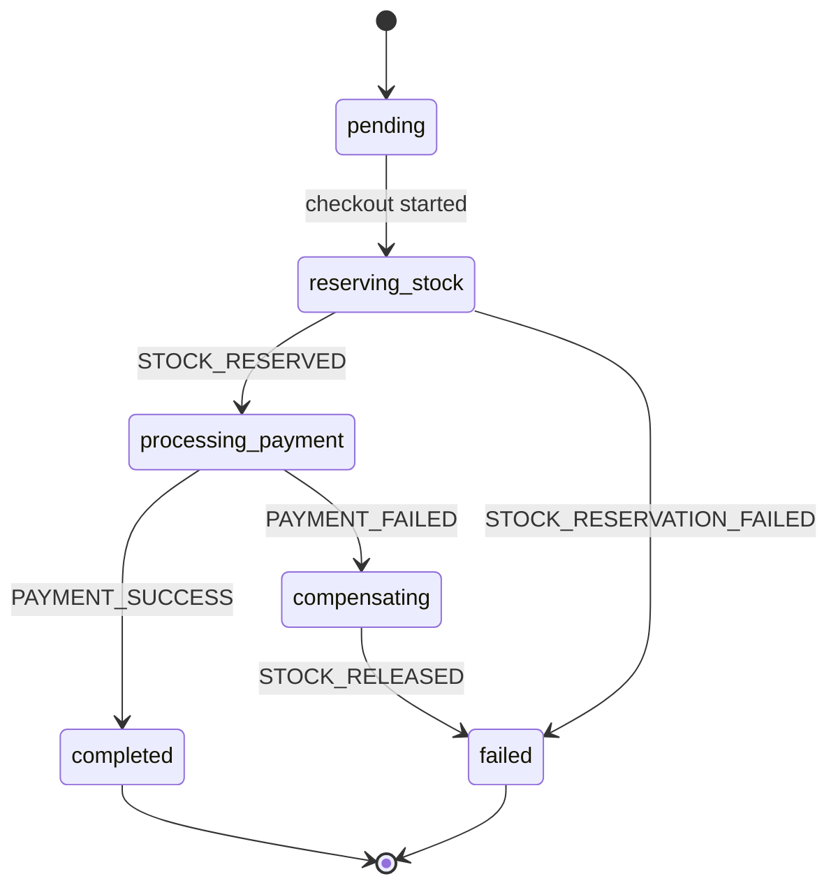
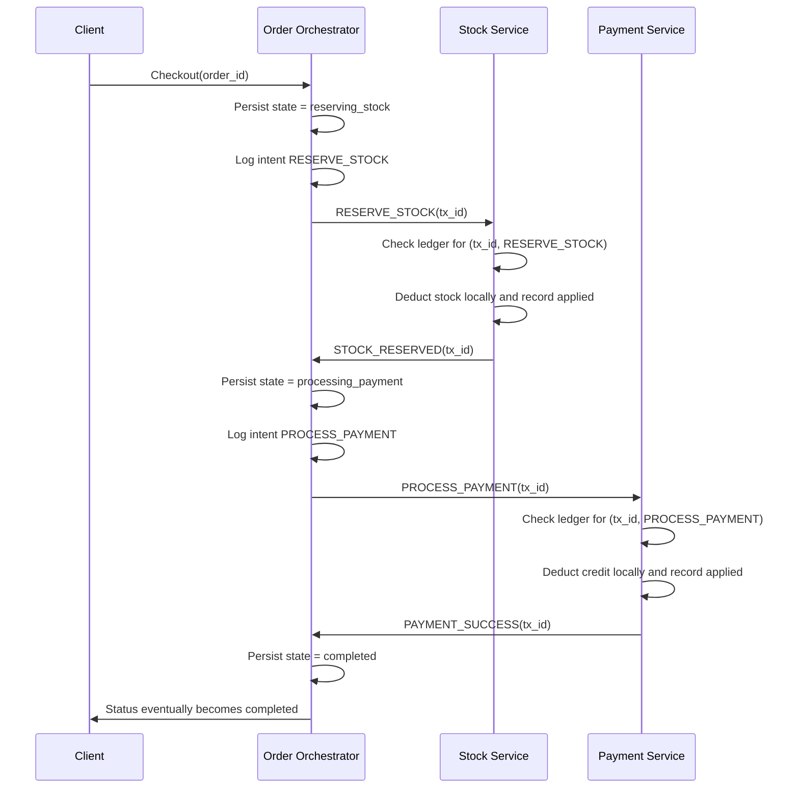
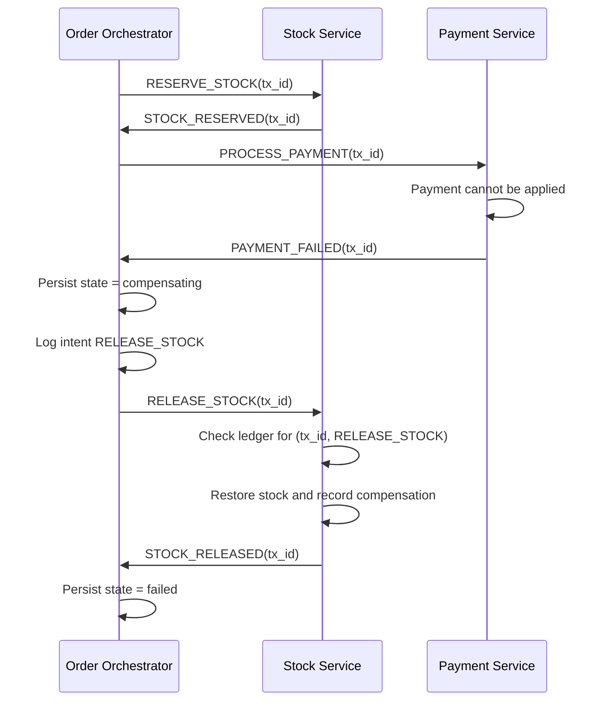
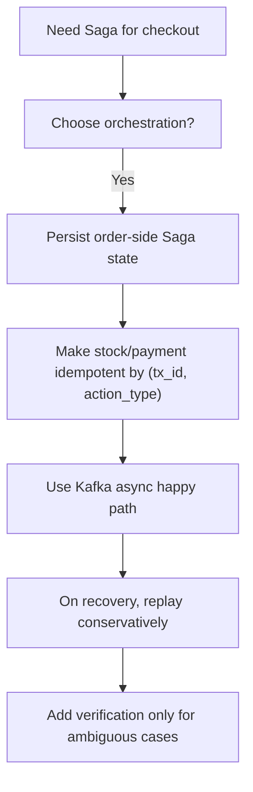

# Saga Design Approaches and Tradeoffs for DDS26 Team 19

## Purpose

This document is not about the whole codebase. It is only about Saga:

- what Saga means in this project
- why the current `simple` mode is not enough
- what "Saga states" are and why they exist
- which IDs matter and whether more are needed
- the main ways you could implement Saga here
- the pros and cons of each approach
- how each approach behaves in failure cases
- which approach is most reasonable for this repo

The goal is to reduce the overload. Instead of seeing "many possible Saga ideas", you should be able to separate them into a few concrete design families and understand why one would be chosen over another.

## 1. What Saga Means in This Project

In this assignment, checkout is a distributed transaction.

A checkout needs to coordinate at least:

- stock deduction
- payment deduction

Those operations happen in different services with different local databases. That means there is no normal single-database transaction covering both.

Saga is the pattern that replaces one big ACID transaction with:

1. a sequence of local transactions
2. plus compensating actions if later steps fail

For this repo, a very simple Saga view is:

1. reserve stock
2. process payment
3. if payment fails, release stock

That is the basic idea. But the professor's warning is about the real problem:

- not just rollback
- but recovery under crashes, duplicates, uncertain sends, and partial progress

So a real Saga here is not just "undo if fail". It is:

- a state machine
- plus durable logs
- plus idempotency
- plus recovery rules

## 2. Why the Current `simple` Mode Is Not Enough

The current `simple` mode is useful as a working async baseline, but it is not yet a robust Saga for the assignment.

It is unsafe because it still assumes too much.

### What `simple` mode already proves

- Kafka messaging works
- order can publish commands
- stock/payment can consume and publish result events
- compensation can be triggered on a normal payment failure

### Why it is still unsafe

- it does not fully reason about crash recovery
- it does not define what to do after ambiguous failures
- it does not give participants strong per-transaction idempotency yet
- it does not solve "did the service really process tx X or not?"
- it does not define restart behavior well enough

So `simple` mode is best understood as:

- a useful async prototype
- not yet the final transactional protocol

## 3. The First Big Choice: Orchestration vs Choreography

There are two broad Saga styles.

## 3.1 Choreography

Each service reacts to events and decides what to emit next. There is no single central coordinator.

Example idea:

- order emits `CheckoutStarted`
- stock reacts and emits `StockReserved`
- payment reacts and emits `PaymentSucceeded`
- some other service reacts to failures and emits compensations

### Pros

- decentralized
- can be loosely coupled
- can scale nicely in some event-driven systems

### Cons

- much harder to reason about in student projects
- failure handling becomes distributed across many services
- debugging and recovery become harder
- it is easier to get "hidden coordination" spread everywhere

## 3.2 Orchestration

One service is the coordinator/orchestrator and explicitly decides the next step.

For this repo that orchestrator is the natural order service.

### Pros

- easier to reason about
- clearer state machine
- simpler place to add recovery logic
- easier to explain in an interview

### Cons

- the orchestrator becomes more complex
- the order service becomes central to correctness

## 3.3 Which one fits this repo?

Orchestration fits this repo much better.

Reasons:

- the order service already starts checkout
- it already receives stock/payment events
- the current structure already uses it as the coordinator
- the assignment values correctness and failure handling highly
- choreography would make the current code harder, not easier

## Recommendation

Choose orchestration, not choreography.

## 4. The Second Big Choice: Synchronous Saga vs Asynchronous Saga

## 4.1 Synchronous Saga

The orchestrator calls participants through HTTP and waits for each reply immediately.

### Pros

- easier to understand
- simpler debugging
- fewer moving parts

### Cons

- tighter coupling
- poorer performance under load
- worse availability when a participant is slow or temporarily down
- weaker fit for the event-driven bonus angle of the assignment

## 4.2 Asynchronous Kafka Saga

The orchestrator publishes commands, participants consume them, then publish result events.

### Pros

- better decoupling
- better throughput potential
- better fit for event-driven design
- better fit for the current repo structure

### Cons

- harder recovery reasoning
- duplicate delivery and offset handling become important
- more state is needed because replies are not immediate

## 4.3 Which one fits this repo?

This repo is already built around Kafka workers and topic-based commands/events, so the realistic choice is:

- asynchronous orchestrated Saga over Kafka

## 5. What "Saga States" Actually Mean

When I say "Saga states", I do not mean arbitrary labels. I mean durable checkpoints describing what the orchestrator currently believes about the transaction.

You need Saga states because after a restart you must know:

- what step had been started
- what step definitely finished
- whether you are waiting
- whether compensation is required
- whether the Saga is terminal

Without states, recovery has to guess.

## 5.1 Good high-level Saga states for this repo

At the orchestrator level, a reasonable set is:

| State | Meaning |
| --- | --- |
| `pending` | order exists, checkout not started |
| `reserving_stock` | stock command has been issued, awaiting result |
| `processing_payment` | payment command has been issued, awaiting result |
| `compensating` | compensation command has been issued, awaiting result |
| `completed` | successful terminal state |
| `failed` | failed terminal state after compensation or direct failure |

## 5.2 Why these states help

### Example: crash after sending payment

If the stored Saga state is `processing_payment`, recovery knows:

- stock probably already succeeded
- payment command was already attempted or intended
- next action is not "start from scratch"

### Example: crash during compensation

If the stored Saga state is `compensating`, recovery knows:

- the Saga should not move forward anymore
- the remaining job is to finish rollback/compensation safely

## 5.3 Do participants also need states?

Yes, but usually not the same ones as the orchestrator.

Participants need local transaction states like:

- `received`
- `applied`
- `event_published`
- `compensated`
- `compensation_published`

These are not for the client. They are for safe idempotency and recovery.

## 6. Which IDs Matter?

Right now the code already has:

- `order_id`
- `tx_id`
- `message_id`

Those are good and necessary, but it is worth being precise about what each one means.

## 6.1 `order_id`

This identifies the business order.

It answers:

- which order is being checked out

It should stay stable for the order itself.

## 6.2 `tx_id`

This identifies one checkout attempt / one distributed transaction.

It answers:

- which Saga instance this message belongs to

Important point:

- if the same order is retried later as a fresh checkout attempt, it should get a new `tx_id`

So:

- `order_id` identifies the business object
- `tx_id` identifies the transaction attempt

## 6.3 `message_id`

This identifies one Kafka message.

It answers:

- is this specific message a duplicate?

This is useful for consumer deduping, tracing, and observability.

But it is not enough for business idempotency by itself.

Why not?

Because a retried command might be sent as a new message with a new `message_id`, even though it is the same business step.

## 6.4 Do you need more IDs?

Possibly yes, but not necessarily more global IDs. Some can be local keys.

### Candidate 1: `action_type`

You already have this implicitly in the message type:

- `RESERVE_STOCK`
- `PROCESS_PAYMENT`
- `RELEASE_STOCK`
- `REFUND_PAYMENT`

For many systems, `tx_id + action_type` is enough to identify one business step uniquely.

That means you may not need an additional global `action_id`.

### Candidate 2: participant operation key

A participant often needs a local unique key like:

- `(tx_id, action_type)`

This is not necessarily a new field on the wire. It can be derived locally.

This is extremely useful for participant ledgers.

### Candidate 3: local log record ID

A local database log row often has its own primary key or sequence number.

You do not need to expose that across services.

It is just useful internally for:

- ordering
- debugging
- storage

### Candidate 4: retry attempt number

This is optional.

You may want it if you track how many times the orchestrator retried a step, but it is not essential for correctness.

### Candidate 5: compensation correlation ID

Usually not necessary if compensation is tied to the same `tx_id`.

Example:

- `PROCESS_PAYMENT` and `REFUND_PAYMENT` both belong to the same `tx_id`

That is usually enough.

## 6.5 Recommended ID model for this repo

Keep it simple:

- `order_id` for the business order
- `tx_id` for the Saga instance / checkout attempt
- `message_id` for each Kafka message
- participant local dedupe key = `(tx_id, action_type)`
- local log row IDs only inside each service

That is likely enough.

## 7. The Main Saga Design Families

There are several realistic design families you could choose from.

Not all of them are equally good for this assignment.

## 7.1 Approach A: Minimal orchestrator-only Saga

### Idea

The order service keeps only a simple state machine and participants mostly just execute commands when asked.

### Normal flow

1. order records `reserving_stock`
2. order sends stock command
3. stock reserves and replies
4. order records `processing_payment`
5. order sends payment command
6. payment replies
7. on failure, order sends compensation

### Pros

- easiest to understand
- smallest amount of code
- fast to prototype

### Cons

- poor crash recovery
- participants are too "dumb" to handle ambiguity safely
- duplicate handling is weak
- not good enough if containers are killed during execution

### Performance

- good on the happy path
- bad under failure because correctness gaps appear

### Correctness

- weakest option

## Verdict

Too weak for the assignment's fault-tolerance expectations.

## 7.2 Approach B: Orchestrator log + idempotent participant ledgers

### Idea

The order service keeps durable Saga state and command/event history.

Each participant also keeps a durable per-transaction record so it can answer:

- did I already perform this action?
- did I already compensate it?
- what result should I return if asked again?

### Normal flow

1. orchestrator logs intent
2. orchestrator sends command
3. participant checks `(tx_id, action_type)`
4. if new, participant applies local change and records it
5. participant publishes result event
6. orchestrator updates Saga state

### Recovery idea

If a service restarts:

- orchestrator reads its Saga state and decides next action
- participant reads its ledger and can replay response or safely ignore duplicate work

### Pros

- strong correctness foundation
- replay-friendly
- good fit for Kafka duplicates and restart recovery
- still practical for a course project

### Cons

- more code than minimal Saga
- requires careful local schema design
- requires participant changes, not just orchestrator changes

### Performance

- still good on happy path
- recovery is acceptable if logs are local and lightweight
- overhead is mostly a few extra local Redis writes

### Correctness

- much stronger
- likely the best practical balance for this repo

## Verdict

This is the best default choice for your project.

## 7.3 Approach C: Orchestrator log + verification queries

### Idea

When recovery sees uncertainty, the orchestrator does not immediately replay or compensate. It first asks the relevant participant:

- "Do you know tx X?"
- "Was this action applied?"

### Example

If the order service crashes after intending to send payment, on restart it might ask payment:

- did you process `PROCESS_PAYMENT` for this `tx_id`?

### Pros

- avoids blind compensation
- reduces the chance of undoing something that never happened
- more precise recovery decisions

### Cons

- more message types or endpoints
- more protocol complexity
- potentially slower recovery because you add verification round-trips
- still requires participant ledgers, otherwise the participant cannot answer accurately

### Performance

- usually fine if verification is only for recovery, not the normal path
- poor if verification is done constantly during the happy path

### Correctness

- very strong if implemented well

## Verdict

Good addition later, but only after Approach B is already in place.

## 7.4 Approach D: Conservative replay of forward and compensation commands

### Idea

On recovery, instead of reasoning too much, the system re-sends whichever command or compensation seems necessary, relying on participant idempotency.

Example:

- if unsure whether payment happened, resend `PROCESS_PAYMENT`
- if the Saga must abort, resend `RELEASE_STOCK`

Participants decide whether this is:

- new
- duplicate
- already compensated

### Pros

- simpler orchestrator recovery logic
- robust if participant idempotency is strong
- often easier to make correct than clever inference

### Cons

- recovery may be slower
- can create more duplicate traffic
- absolutely depends on participant ledgers

### Performance

- happy path stays fast
- recovery may be noisier

### Correctness

- very good if participant idempotency is solid

## Verdict

Very compatible with Approach B. This is probably the right recovery style for your repo.

## 7.5 Approach E: Fully event-sourced / outbox-heavy design

### Idea

Treat logs as the system of record and rebuild state by replaying events or outbox entries.

### Pros

- powerful
- elegant for some architectures
- great auditability

### Cons

- too heavy for this repo unless the team explicitly wants a much harder system
- large implementation cost
- more moving pieces than needed for the assignment

## Verdict

Probably overkill for your current situation.

## 8. Approach Comparison Table

| Approach | Correctness | Happy-path performance | Recovery simplicity | Implementation complexity | Fit for this repo |
| --- | --- | --- | --- | --- | --- |
| Minimal orchestrator only | Low | High | Low | Low | Poor |
| Orchestrator log + participant ledgers | High | Good | Medium | Medium | Best |
| Orchestrator + verification queries | Very high | Good if only on recovery | Medium | Medium-high | Good later |
| Conservative replay with idempotent participants | High | Good | High | Medium | Very good |
| Full event sourcing/outbox-heavy | Very high | Medium | Medium | High | Overkill |

## 9. Recommended Overall Design

For this repo, the most sensible target is:

- orchestrated Saga
- asynchronous Kafka commands/events
- durable orchestrator state
- participant-local transaction ledgers
- idempotent forward and compensation commands
- conservative replay on recovery
- optional verification later for ambiguous cases

In short:

> Approach B as the foundation, with Approach D as the recovery style, and optionally some Approach C later.

That gives the best balance of:

- correctness
- explainability
- implementation cost
- performance

## 10. Suggested Saga State Machine

Below is a suggested orchestrator state machine for this repo.

### Interpretation

- `pending`: order exists but no checkout yet
- `reserving_stock`: stock step in progress
- `processing_payment`: payment step in progress
- `compensating`: rollback/compensation in progress
- `completed`: successful terminal result
- `failed`: failed terminal result

### Why not more states?

You could add many more, but do not overcomplicate the client-facing state machine too early.

It is fine to keep client-facing states small while participant ledgers keep richer local state internally.

## 11. Suggested Participant Local States

Participants do not need the same state names as the orchestrator.

For each `(tx_id, action_type)` they could track something like:

| Local state | Meaning |
| --- | --- |
| `received` | command seen |
| `applied` | local business change committed |
| `event_published` | result event emitted |
| `compensated` | compensation applied |
| `compensation_published` | compensation result event emitted |

These states are useful because they answer the recovery question:

- what did this service definitely already do for this transaction?

## 12. Suggested Local Data Model

## 12.1 Orchestrator / order service

For each `tx_id`, the order service should store at least:

- `tx_id`
- `order_id`
- current Saga state
- current step
- user id
- amount
- item list
- last command type intended/sent
- last event observed
- failure reason if any
- whether compensation is required
- timestamps

It is also useful to keep an append-only log of:

- `command_intent_logged`
- `event_received`
- `state_transition`
- `compensation_decided`

## 12.2 Payment service

For each `(tx_id, action_type)`:

- `tx_id`
- action type
- user id
- amount
- local state
- business result
- timestamps

Optionally:

- whether reply event already published
- reply payload to re-emit on duplicate/recovery

## 12.3 Stock service

For each `(tx_id, action_type)`:

- `tx_id`
- action type
- affected items
- local state
- business result
- timestamps

Again, storing the reply result is useful so duplicates can return the same event safely.

## 13. Happy Path Flow for the Recommended Approach

### Why this path is good

- every service has durable local memory
- retries are possible
- duplicates are survivable
- happy path still stays short

## 14. Payment Failure Flow for the Recommended Approach

### Why this works

- payment failure does not leave stock lost
- compensation is explicit
- recovery after crash can resume from `compensating`

## 15. Edge Cases and How Each Design Handles Them

This is the part that usually feels overwhelming. The trick is to group edge cases into patterns.

## 15.1 Crash after logging intent but before sending command

### Problem

The orchestrator log says:

- "I intended to send PROCESS_PAYMENT"

but maybe the command never left the service.

### Bad solution

Blindly assume the command happened.

### Better solution

On recovery:

- consult Saga state
- either replay the command conservatively
- or verify with the participant if you later add verification

### Which approach handles this well?

- minimal orchestrator only: badly
- orchestrator + participant ledgers: well
- orchestrator + verification: very well

## 15.2 Crash after sending command but before updating orchestrator state

### Problem

The participant may have acted, but the orchestrator's memory is stale.

### Better solution

This is exactly why:

- intent should be logged before send
- participant should keep a ledger
- replay should be safe

## 15.3 Participant crash after local apply but before publishing event

### Problem

Example:

- payment deducted credit
- then crashed before emitting `PAYMENT_SUCCESS`

The orchestrator does not know whether payment happened.

### Better solution

Payment's local ledger should show:

- tx was applied
- success event may still need to be published

On restart, payment can:

- re-emit the success event
- or answer verification queries

### Which approach handles this well?

- participant ledgers are essential here

## 15.4 Duplicate command delivery

### Problem

Kafka or recovery replay may send the same business step again.

### Better solution

Participant checks:

- have I already processed `(tx_id, action_type)`?

If yes:

- do not apply the business effect again
- optionally re-emit the same result event

## 15.5 Duplicate event delivery

### Problem

The orchestrator receives `PAYMENT_FAILED` twice.

### Better solution

The orchestrator uses:

- `message_id` for event dedupe
- Saga state checks so it does not send compensation twice

## 15.6 Late stale event from an old transaction

### Problem

An event arrives for a `tx_id` that is no longer the current checkout attempt for the order.

### Better solution

The orchestrator compares:

- event `tx_id`
- active Saga `tx_id`

If they do not match:

- ignore as stale

## 15.7 Compensation sent for an action that never happened

### Problem

Suppose recovery decides to compensate payment, but payment never actually charged the user.

### Safe solution

Participant compensation handler must inspect its local ledger.

If no forward action was ever applied:

- compensation becomes a no-op
- but it should still respond deterministically

This is exactly why the professor emphasized:

- do not blindly compensate
- participants must know whether the original action happened

## 16. Recovery Styles in More Concrete Terms

There are three practical recovery styles worth understanding.

## 16.1 Abort aggressively on recovery

Idea:

- if the Saga is incomplete after restart, abort and compensate everything you can

### Pros

- simple orchestrator logic

### Cons

- may compensate things that never happened unless participants are very careful
- may slow recovery
- can be wasteful

## 16.2 Resume forward progress if possible

Idea:

- if the Saga state says you were waiting for payment, keep trying to finish payment

### Pros

- better latency if failure was temporary
- less unnecessary compensation

### Cons

- recovery logic is slightly more complex

## 16.3 Verify first, then decide

Idea:

- ask participants about uncertain steps before choosing resume or abort

### Pros

- most accurate

### Cons

- more protocol overhead

## Recommendation

Use a hybrid policy:

- during normal operation, move forward
- after restart, use state plus conservative replay
- add verification only for ambiguous cases where replay/compensation is too risky

## 17. Performance vs Correctness Tradeoff

The assignment emphasizes correctness first and performance second.

That does not mean performance can be ignored. It means:

- do not trade correctness away for a tiny speed gain

### Good performance choices

- keep the happy path short
- do not add verification round-trips during normal success flow
- store compact local records
- make compensation and recovery asynchronous where possible
- use Kafka for decoupled throughput

### Bad performance choices

- querying participants on every step even when there is no uncertainty
- overly chatty compensation protocols
- storing huge redundant logs when one compact ledger would do

### A good balance

- normal path: log, send, apply, reply
- recovery path: replay conservatively
- only verify when uncertainty truly matters

That gives good performance without sacrificing safety.

## 18. What I Mean by "Participant Ledger"

This is an important phrase, so it is worth making explicit.

A participant ledger is a local durable record of transaction actions.

For example, in payment:

| tx_id | action_type | local_state | result |
| --- | --- | --- | --- |
| `abc` | `PROCESS_PAYMENT` | `applied` | success |
| `abc` | `REFUND_PAYMENT` | `compensated` | success |

This lets payment answer:

- "yes, I already processed that"
- "no, I never did"
- "I already refunded it"

That is the key to safe replay.

## 19. What About a Separate Compensation ID?

Usually you do not need one.

Why?

Because compensation is usually just another action type inside the same `tx_id`.

Example:

- forward action: `(tx_id, PROCESS_PAYMENT)`
- compensation action: `(tx_id, REFUND_PAYMENT)`

That is already distinct enough.

So for this project, I would not add a separate global compensation ID unless you later discover a very specific need.

## 20. What About Timeouts?

Timeouts are part of a real Saga design because waiting forever is not acceptable.

### Example timeout rule

If the orchestrator remains in `processing_payment` too long:

- mark the Saga as timed out
- trigger recovery logic
- decide whether to replay, verify, or compensate

Timeouts do not solve correctness by themselves. They only tell you:

- "this Saga may now need recovery attention"

## 21. The Cleanest Mental Decision Tree

When you feel overwhelmed, reduce the decision to this:

That is the core recommended path.

## 22. The Main Alternatives and Why You Probably Should Not Choose Them

### "Just keep the current simple flow and add some extra if-statements"

Why not:

- it does not address uncertainty properly
- it will become ad hoc and fragile

### "Make only the order service smarter, leave participants dumb"

Why not:

- recovery depends on what participants actually did
- if participants cannot remember that, the orchestrator cannot recover safely

### "Use verification everywhere"

Why not:

- too much overhead
- too much complexity
- unnecessary on the happy path

### "Go full event sourcing"

Why not:

- probably too much for your current repo and deadline

## 23. Recommended Incremental Implementation Order

This is the order I would personally follow.

### Stage 1: freeze the protocol on paper

Define:

- message types
- Saga states
- participant local states
- recovery rules

### Stage 2: participant ledgers first

Before fancy orchestrator recovery, make sure participants can safely handle duplicates and replays.

### Stage 3: orchestrator durable Saga record

Persist current state and intended next action.

### Stage 4: happy-path Saga

Make the normal successful flow work using the new state model.

### Stage 5: normal failure compensation

Make payment failure and stock failure safe.

### Stage 6: restart recovery

Now implement:

- restart scan
- replay
- timeout handling

### Stage 7: optional verification

Add only if the assignment pressure or specific ambiguous cases justify it.

## 24. Final Recommendation in One Paragraph

If you want the clearest choice: implement an orchestrated Kafka Saga where the order service stores the Saga state, stock and payment store per-transaction participant ledgers keyed by `(tx_id, action_type)`, normal operation stays fast and asynchronous, recovery uses conservative replay of idempotent commands/compensations, and verification queries are added only later for truly ambiguous cases. That gives the best balance of correctness, performance, explainability, and implementation difficulty for this repo.

## 25. Short Takeaway List

If you only remember a few things from this document, remember these:

1. The most important Saga choice here is orchestration, not choreography.
2. `tx_id` is the business transaction identity; `message_id` is only the message identity.
3. Saga states are durable checkpoints for recovery, not just labels.
4. Participant local ledgers are as important as the orchestrator state.
5. Conservative replay with idempotent participants is usually better than guessing.
6. Verification is useful, but mostly for recovery, not for the happy path.
7. The best fit for this repo is not the simplest Saga, but the simplest Saga that survives ambiguity.
